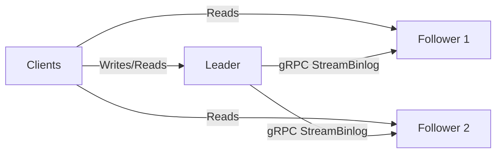

# MDDB — AI-Native Document Database

[](https://golang.org)
[](LICENSE)
[](https://github.com/tradik/mddb/releases)
[](https://hub.docker.com/r/tradik/mddb)
[](https://hub.docker.com/r/tradik/mddb)
[](https://github.com/tradik/mddb/actions)
[](https://codecov.io/gh/tradik/mddb)

**AI-native document database with built-in MCP server, file upload (PDF/DOCX/HTML/ODT/RTF/TEX/YAML/Wikipedia XML→Markdown), vector search, RAG pipelines, and 80 MCP tools. Plugs directly into Claude, ChatGPT, Cursor, Windsurf, and any MCP-compatible agent.**

MDDB is a document database purpose-built for AI agents and LLM workflows. Upload files (PDF, DOCX, HTML, ODT, RTF, TEX, YAML, TXT) — they're auto-converted to Markdown and embedded for semantic search. Expose everything to AI agents via 80 built-in MCP tools. Integrates with [Docling](docs/INTEGRATIONS.md#1-docling--mddb-document-ingestion), [Langflow](docs/INTEGRATIONS.md#2-langflow--mddb-visual-rag-orchestration), [OpenSearch](docs/INTEGRATIONS.md#3-opensearch--mddb-scalable-search), [SSG](docs/INTEGRATIONS.md#4-ssg--static-site-generator-from-mddb), [wpexporter](docs/INTEGRATIONS.md#5-wpexporter--wordpress-to-mddb-migration), [Airbyte](docs/INTEGRATIONS.md#6-airbyte--mddb-elt-destination-connector), [WordPress Sync](docs/INTEGRATIONS.md#7-wordpress--mddb-sync-plugin), a [GitHub Action](docs/INTEGRATIONS.md#8-github-action--mddb-ci-sync), a [Grafana datasource](docs/INTEGRATIONS.md#9-grafana--mddb-datasource-plugin), and a [Chrome browser extension](docs/INTEGRATIONS.md#10-chrome-extension--mddb-browser-toolbar) for production pipelines. Single ~26MB binary, zero configuration, BoltDB embedded storage, triple-protocol APIs (HTTP + gRPC + GraphQL).

## 🎯 What is MDDB?

MDDB gives your AI agents a persistent, searchable knowledge base:

- **File Upload** - Upload PDF, DOCX, HTML, ODT, RTF, TEX, YAML, TXT files — auto-converted to Markdown and indexed
- **Wikipedia Import** - Stream and import MediaWiki XML dumps (`.xml.bz2`) — wikitext auto-converted to Markdown, namespace filtering, handles multi-GB files
- **Built-in MCP Server** - 80 tools for Claude Desktop, Cursor, Windsurf, or any MCP client
- **Vector Search** - Auto-embed documents, semantic similarity with 7 index algorithms (Flat, HNSW, IVF, PQ, OPQ, SQ, BQ) + per-collection quantization (int8/int4) + [disk-only low-memory mode](docs/QUANTIZATION.md#disk-only-vectors--low-memory-mode-v2114) + ARM NEON/SME hardware acceleration + goroutine parallel search
- **Embedding Providers** - Pluggable: OpenAI, Ollama, Voyage, Cohere — configured per server or per collection ([guide](docs/EMBEDDING_PROVIDERS.md))
- **[Geo Search](docs/GEOSEARCH.md)** - R-tree and geohash indexes for radius/bounding-box queries, composable with FTS/vector via `hybrid-search`, optional postcode lookup
- **RAG-Ready** - Hybrid search (BM25 keyword + vector, fused with RRF or alpha blending), [parent/chunk/window retrieval modes](docs/SEARCH.md#retrieval-modes--parent-chunk-window-v2114) for precise LLM context, [MMR result diversification](docs/SEARCH.md#mmr-result-diversification-v2114), and per-query metadata boosting (freshness/recency ranking)
- **Native Multi-Tenancy** - [Namespace isolation per tenant](docs/MULTI_TENANCY.md) across HTTP/gRPC/GraphQL/MCP — ready for SaaS backends
- **Zero-Maintenance Storage** - Single-file embedded database with automatic space management — no vacuum, compaction jobs, or index maintenance windows
- **Memory RAG** - Conversational memory system: store, recall, and summarize chat sessions with semantic search
- **Integrations** - [Docling](docs/INTEGRATIONS.md), [Langflow](docs/INTEGRATIONS.md), [OpenSearch](docs/INTEGRATIONS.md), [SSG](docs/INTEGRATIONS.md), [wpexporter](docs/INTEGRATIONS.md), [Airbyte](docs/INTEGRATIONS.md#6-airbyte--mddb-elt-destination-connector), [WordPress Sync](docs/INTEGRATIONS.md#7-wordpress--mddb-sync-plugin), [GitHub Action](docs/INTEGRATIONS.md#8-github-action--mddb-ci-sync), [Grafana datasource](docs/INTEGRATIONS.md#9-grafana--mddb-datasource-plugin), [Chrome extension](docs/INTEGRATIONS.md#10-chrome-extension--mddb-browser-toolbar) for production pipelines
- **Zero-Shot Classification** — Classify documents against candidate labels using embeddings, no training data
- **Custom AI Tools** - Define YAML-based MCP tools for domain-specific workflows
- **Code Documents** - Store HTML/CSS/JS alongside prose; a `kind: ["code"]` convention on the existing flat meta switches to a source-aware tokeniser that keeps `.hero-banner` and `checkoutHandler` findable whole and in parts ([API.md](docs/API.md#code-documents))
- **Code Symbols** - Each code document records what it `defines`, `uses` and `imports` in its meta, so `meta.defines=.hero-banner` returns the stylesheet that declares the selector instead of the twelve templates that apply it ([API.md](docs/API.md#symbols-which-file-declares-this))
- **Code Connection Graph** - What breaks if this selector changes, which pages load this script, what does nothing reference any more. Edges are derived from the symbol meta, never stored, so a reindex reproduces the graph exactly ([API.md](docs/API.md#the-connection-graph))
- **Per-Collection Retrieval Profiles** - Search type, topK, granularity, hybrid strategy and a context token budget stored with the collection instead of repeated by every client; an explicit request parameter always wins ([API.md](docs/API.md#retrieval-defaults-v2120))
- **Agent Instructions** - Ready-made guidance for Claude Code, Cursor and Windsurf on which tool fits a question and how to ask for chunks instead of whole documents ([integrations/agent-instructions/](integrations/agent-instructions/)) — measured at 60x fewer tokens for the same search
- **Full-Text Search** - Built-in inverted index with TF-IDF, BM25, BM25F, PMISparse, 8 search modes (simple, boolean, phrase, wildcard, proximity, **expression**, range, fuzzy), typo tolerance, multi-language stemming (18 languages), synonyms, per-query metadata boost/demote, prefix autocomplete, **search-result highlighting with fragments**
- **Geosearch** - R-tree + geohash radius/bbox queries, **GeoJSON polygon and multi-polygon containment**, postcode lookup, **distance-sorted hybrid search** combining proximity with keyword/vector relevance
- **Async Bulk Ingest** - Queue long-running document imports with job tracking, progress polling, and optional webhook callback
- **Full Revision History** - Every update creates a new revision with complete snapshots
- **Multi-Protocol APIs** - HTTP/JSON (easy), gRPC (fast), GraphQL (flexible), and WebSocket streaming via [mddb-chat](services/mddb-chat/) for LLM chat pipelines
- **Automation** - Triggers, crons, webhooks with template variables and sentiment analysis
- **Real-Time Events** - Server-Sent Events (SSE) for live document change notifications
- **MCP Transports** - Streamable HTTP (`/mcp`, 2025-11-25), legacy SSE (`/sse`), and stdio
- **Built-in TLS** - Native HTTPS support, connection pooling, pprof profiling
- **Zero Configuration** - Single ~26MB binary, embedded database, no dependencies

**Perfect for:** AI agent memory, RAG pipelines, knowledge bases for LLMs, documentation chatbots, semantic search APIs, document processing (PDF/DOCX→Markdown), static site generation, WordPress migration

## 🚀 Quick Start

### Docker Compose (Recommended) - Full Stack

Start all services with one command:

```bash
git clone https://github.com/tradik/mddb.git
cd mddb

# Production mode (all services) — set the secrets first, see below
cp .env.example .env && $EDITOR .env
docker compose up -d

# Development mode (with hot reload)
make dev-start

# Development + Ollama for embeddings
make dev-start-with-ollama
```

> **The production compose refuses to start without credentials.** The image
> defaults to `MDDB_AUTH_ENABLED=false`, which suits a throwaway `docker run`
> but not `docker-compose.yml`, which runs the server read-write and publishes
> HTTP, gRPC and MCP. So the compose file turns authentication on and reads
> `MDDB_AUTH_JWT_SECRET` and `MDDB_AUTH_ADMIN_PASSWORD` from `.env` with no
> fallback: leave either unset and compose stops with an error naming the
> variable, rather than quietly starting an open database.
>
> Every port is published on `127.0.0.1` by default. A reverse proxy or
> cloudflared reaches the containers over `mddb-network` and needs no published
> port at all; to expose the stack on the host's interfaces, set
> `MDDB_BIND_ADDR=0.0.0.0` — deliberately, and only with authentication on.

> **Importing existing content:** MDDB does not automatically index bind-mounted
> directories. Use [`scripts/load-md-folder.sh`](docs/BULK-IMPORT.md) or the ingest
> API to load existing Markdown files.

**Services started:**

| Service | Port | Image | Description |
|---------|------|-------|-------------|
| **mddbd** | 11023 (HTTP), 11024 (gRPC), 9000 (MCP), 11443 (HTTP/3) | `tradik/mddb:latest` | Database server with MCP built-in |
| **mddb-panel** | 3000 | `tradik/mddb:panel` | React web admin UI |

### Connect to Claude / Cursor / Windsurf (MCP)

MDDB has a built-in MCP server — no extra service needed. Add to your MCP config:

```json
{
  "mcpServers": {
    "mddb": {
      "command": "docker",
      "args": [
        "run", "-i", "--rm", "--network", "host",
        "-v", "mddb-data:/app/data",
        "-e", "MDDB_MCP_STDIO=true",
        "tradik/mddb:latest"
      ]
    }
  }
}
```

That's it — your AI agent now has full access to your knowledge base with 80 built-in tools (add, search, vector search, classify, and more).

**[→ Full MCP setup guide](docs/LLM_CONNECTIONS.md)** | **[→ MCP server config](docs/MCP.md)** | **[→ Custom MCP tools](docs/CUSTOM-TOOLS.md)**

### Docker - Individual Services

```bash
# MDDB Server only
docker run -d --name mddb \
  -p 11023:11023 -p 11024:11024 -p 9000:9000 \
  -v mddb-data:/data \
  tradik/mddb:latest

# Web Panel (connect to existing server)
docker run -d --name mddb-panel \
  -p 3000:3000 \
  -e VITE_MDDB_SERVER=host.docker.internal:11023 \
  tradik/mddb:panel

# MCP stdio mode (for Claude Desktop, Windsurf, etc.)
docker run -i --rm --network host \
  -v mddb-data:/app/data \
  -e MDDB_MCP_STDIO=true \
  tradik/mddb:latest

# Test it
curl http://localhost:11023/health
```

**Docker Hub:** https://hub.docker.com/r/tradik/mddb

### Install Binary

**Linux (Debian/Ubuntu):**
```bash
wget https://github.com/tradik/mddb/releases/latest/download/mddbd-latest-linux-amd64.deb
sudo dpkg -i mddbd-latest-linux-amd64.deb
sudo systemctl start mddbd
```

**macOS (Apple Silicon):**
```bash
wget https://github.com/tradik/mddb/releases/latest/download/mddbd-latest-darwin-arm64.tar.gz
tar xzf mddbd-latest-darwin-arm64.tar.gz
sudo mv mddbd-latest-darwin-arm64/mddbd /usr/local/bin/
mddbd
```

**CLI Client:**
```bash
# Linux
wget https://github.com/tradik/mddb/releases/latest/download/mddb-cli-latest-linux-amd64.deb
sudo dpkg -i mddb-cli-latest-linux-amd64.deb

# Usage
mddb-cli stats
mddb-cli add blog hello en_US -f post.md
mddb-cli search blog -f "tags=tutorial"
mddb-cli fts blog --query="getting started" --algorithm=bm25
```

**Other platforms:** See [Installation Guide](docs/INSTALLATION.md)

### Build from Source

```bash
git clone https://github.com/tradik/mddb.git
cd mddb
make build
./services/mddbd/mddbd
```

### Development with Go Workspace

MDDB is a Go monorepo with multiple modules (`services/mddbd`, `services/mddb-cli`, `clients/go/mddb`, `tools/bench`). A [`go.work`](go.work) file at the repo root enables Go workspace mode for local development:

- **Cross-module refactoring** — renaming a symbol in `services/mddbd` immediately updates references in `services/mddb-cli` via `gopls`.
- **Unified build** — `go build ./services/mddbd/... ./services/mddb-cli/... ./tools/bench/...` from the repo root.
- **IDE "goto definition"** works across module boundaries without opening each module separately.

#### `services/mddbd` internal package structure (GO-015)

The daemon was refactored from one flat ~58k-LOC `package main` into importable, independently-testable `internal/` packages. Server-independent leaves and dependency-inverted subsystems now live behind compilation boundaries:

| Area | Packages |
|---|---|
| Storage & docs | `internal/storage` (the `Doc` type, key builders, proto conversion), `internal/binlog` (replication log), `internal/compression`, `internal/delta` |
| Search | `internal/fts` (full-text), `internal/vector` (ANN/embeddings/SIMD), `internal/geo`, `internal/spell`, `internal/embedding` |
| Subsystems | `internal/cache`, `internal/metrics` (inverted via `StatsProvider`), `internal/indexqueue` (inverted via `Store`), `internal/ttl` (inverted via `Reaper`), `internal/encryption`, `internal/webhooks`, `internal/automationlog`, `internal/schema`, `internal/temporal`, `internal/audit` |
| Shared utilities | `internal/envconf`, `internal/sliceutil`, `internal/httpclient` (pooled SSRF-safe client), `internal/wikitext`, `internal/sentiment` |

HTTP/gRPC/MCP/GraphQL handlers stay in `package main` as thin transport over these packages. The HTTP API client is a separate shared module, [`clients/go/mddb`](clients/go/mddb/) (`mddb-client`), consumed by `mddb-cli` and external Go integrations.

**CI runs in module-isolation mode** (`GOWORK=off` in [`.github/workflows/test.yml`](.github/workflows/test.yml) and [`release.yml`](.github/workflows/release.yml)) so each module builds and tests independently. This catches missing `require` entries that workspace mode would transparently resolve from sibling modules.

To use the same mode locally for debugging:

```bash
GOWORK=off go build ./...   # from inside services/mddbd
```

Regenerating protos (`buf generate`) and Docker builds are unaffected by `go.work` — they operate on individual modules.

## 📦 Packages & Client Libraries

MDDB ships as a monorepo with multiple packages:

### Server & Tools

| Package | Language | Location | Description |
|---------|----------|----------|-------------|
| **mddbd** | Go | `services/mddbd/` | Database server (HTTP + gRPC + GraphQL + MCP) |
| **mddb-panel** | React/JS | `services/mddb-panel/` | Web admin panel |
| **mddb-cli** | Go | `services/mddb-cli/` | Command-line client with GraphQL support |
| **mddb-chat** | Rust | `services/mddb-chat/` | WebSocket chat server with LLM integration |
| **mddb-chat-widget** | JS/TS | `services/mddb-chat-widget/` | Embeddable JS chat widget |

### Client Libraries (REST)

Zero-dependency HTTP clients - copy a single file into your project:

| Library | Language | Location | Install |
|---------|----------|----------|---------|
| **PHP Extension** | PHP 8.0+ | `services/php-extension/mddb.php` | Copy `mddb.php` into your project |
| **Python Extension** | Python 3.8+ | `services/python-extension/mddb.py` | Copy `mddb.py` into your project |

**PHP:**
```php
require_once 'mddb.php';
$db = mddb::connect('localhost:11023', 'write');
$db->collection('blog')->add('hello', 'en_US', ['author' => ['John']], '# Hello');
$results = $db->collection('blog')->vectorSearch('cancel subscription', 5, 0.7);
```

**Python:**
```python
from mddb import MDDB
db = MDDB.connect('localhost:11023', 'write').collection('blog')
db.add('hello', 'en_US', {'author': ['John']}, '# Hello')
results = db.vector_search('cancel subscription', top_k=5)
```

### Client Libraries (gRPC)

High-performance clients generated from Protocol Buffers:

| Library | Language | Location | Description |
|---------|----------|----------|-------------|
| **Go HTTP client** | Go | [`clients/go/mddb/`](clients/go/mddb/) | Official HTTP/JSON SDK — shared by `mddb-cli` and external Go integrations |
| **Go gRPC stubs** | Go | `services/mddbd/proto/` | Native Go gRPC stubs |
| **Python gRPC** | Python | `clients/python/` | Generated Python gRPC client |
| **Node.js gRPC** | Node.js | `clients/nodejs/` | Uses `@grpc/grpc-js` |

Proto definitions at `proto/mddb.proto` - generate clients for any language supported by protobuf.

The Go HTTP SDK is a standalone module (`mddb-client`); import it directly:

```go
import mddb "mddb-client" // replace => ./clients/go/mddb in the monorepo

c := mddb.New("http://localhost:11023", mddb.WithAPIKey(os.Getenv("MDDB_API_KEY")))
doc, err := c.Add(ctx, mddb.AddRequest{Collection: "blog", Key: "hello", Lang: "en", ContentMD: "# Hi"})
```

### Docker Images ([Docker Hub](https://hub.docker.com/r/tradik/mddb))

| Image | Size | Description |
|-------|------|-------------|
| `tradik/mddb:latest` | ~26MB | Database server with MCP built-in (Alpine) |
| `tradik/mddb:panel` | ~88MB | Web admin panel (Node Alpine) |
| `tradik/mddb:cli` | ~8MB | CLI client (Alpine) |

### System Packages

| Format | Platform | Contents |
|--------|----------|----------|
| `.deb` | Debian/Ubuntu | mddbd + systemd unit + man page |
| `.rpm` | RHEL/CentOS/Fedora | mddbd + systemd unit + man page |
| `.tar.gz` | Any (Linux, macOS, FreeBSD) | Standalone binary |

## 💡 Key Features

### AI & Search
- ✅ **MCP Server** - 80 built-in tools via Model Context Protocol 2025-11-25 (stdio + Streamable HTTP + SSE) with tool annotations, prompts, completion, and structured output
- ✅ **WordPress Publishing** - `wordpress_publish` / `wordpress_set_status` MCP tools create, update and (un)publish posts & pages on sites running the [mddb-sync plugin](integrations/wordpress-plugin/README.md) — tags, categories, meta fields and Polylang/WPML translations included ([docs](docs/MCP.md#wordpress-publishing-tools-v2110))
- ✅ **File Upload** - Upload PDF, DOCX, HTML, ODT, RTF, TEX, YAML, TXT — auto-converted to Markdown (single and batch, configurable size limit)
- ✅ **Wikipedia Import** - Stream MediaWiki XML dumps (`.xml.bz2`) with wikitext→Markdown conversion, namespace filtering, batch processing
- ✅ **Vector Search** - Semantic similarity with auto-embeddings (OpenAI, Ollama, Cohere, Voyage), ARM NEON/SME SIMD acceleration
- ✅ **Full-Text Search** - Built-in inverted index with TF-IDF, BM25, BM25F, PMISparse scoring, 7 search modes (simple, boolean, phrase, wildcard, proximity, range, fuzzy), typo tolerance, metadata pre-filtering, multi-language stemming and stop words (18 languages)
- ✅ **Hybrid Search** - Sparse (BM25) + dense (vector) fusion with alpha blending or RRF
- ✅ **Aggregations** - Metadata facets (value counts) and date histograms with optional pre-filtering
- ✅ **Inline Facets on Search** (v2.9.14+) - Pass `facetBy` to `/v1/fts` or `/v1/hybrid-search` and get per-key value counts alongside results — no separate aggregate call
- ✅ **Curation Rules** (v2.9.14+) - Pin or hide documents for specific queries via `/v1/curation` (CRUD); applied in FTS + Hybrid pipelines
- ✅ **Zero-Shot Classification** - Classify documents against candidate labels using embedding similarity
- ✅ **Custom MCP Tools** - Define YAML-based AI tools for domain-specific workflows
- ✅ **RAG Pipeline** - Built-in support for retrieval-augmented generation workflows
- ✅ **Integrations** - Docling, Langflow, OpenSearch, SSG, wpexporter, Airbyte, WordPress Sync, GitHub Action, Grafana datasource, Chrome browser extension ([guide](docs/INTEGRATIONS.md))

### Core Functionality
- ✅ **Document Management** - Full CRUD with metadata and collections
- ✅ **Revision History** - Complete version control with snapshots, per-collection retention cap (`maxRevisions`, v2.9.14+) trimmed synchronously on every write
- ✅ **Metadata Search** - Fast indexed queries with multi-value tags
- ✅ **Collection Checksum** - Lightweight CRC32 checksum per collection for cache invalidation
- ✅ **Partial Document Update** - Update metadata and/or content independently
- ✅ **Document TTL** - Time-to-live with automatic cleanup
- ✅ **Temporal Tracking** - Document event history (create/update/access), hot-docs leaderboard, activity histograms (env `MDDB_TEMPORAL=true`)
- ✅ **Spell Correction** - SymSpell-based FTS spell suggestions, text cleanup, per-collection custom dictionaries (env `MDDB_SPELL=true`)
- ✅ **Automation** - Triggers, crons, webhooks with template variables, sentiment analysis, execution logs
- ✅ **Multi-language** - Same key, multiple languages
- ✅ **Schema Validation** - JSON Schema validation per collection
- ✅ **Per-Collection Storage Backends** - Choose BoltDB (default), in-memory (ephemeral), or S3/MinIO per collection

### APIs & Protocols
- ✅ **HTTP/JSON REST** - Easy debugging, extensive docs
- ✅ **gRPC/Protobuf** - 16x faster, 70% smaller payload
- ✅ **GraphQL** - Flexible queries, schema introspection, Playground
- ✅ **CLI Client** - Full-featured command-line with GraphQL support
- ✅ **Web Panel** - React UI with REST/GraphQL toggle

### Security & Access
- ✅ **Authentication** - JWT tokens and API keys
- ✅ **Authorization** - Collection-level RBAC (Read/Write/Admin)
- ✅ **Per-Protocol Access Modes** - `MDDB_MCP_MODE=read` (MCP read-only), `MDDB_API_MODE`, `MDDB_GRPC_MODE`, `MDDB_HTTP3_MODE`
- ✅ **MCP Tool Control** - `MDDB_MCP_BUILTIN_TOOLS=false` to expose only custom YAML tools
- ✅ **User Management** - Multi-user with admin roles
- ✅ **[Native Multi-Tenancy](docs/MULTI_TENANCY.md)** - Namespace isolation per tenant, enforced centrally across HTTP/gRPC/GraphQL/MCP; zero config for single-tenant deployments
- ✅ **Group Permissions** - Organize users into groups
- ✅ **[TLS / HTTPS](docs/TLS.md)** - `MDDB_TLS_ENABLED=true`, `MDDB_TLS_CERT`, `MDDB_TLS_KEY` — user-supplied PEM cert + key, TLS 1.2 minimum
- ✅ **[Mutual TLS (mTLS)](docs/TLS.md#quick-start-mtls--clients-must-present-certificates)** - `MDDB_TLS_CLIENT_CA` points to a PEM bundle of trusted client CAs; `MDDB_TLS_CLIENT_AUTH=require` (default) or `request`. Rejects unauthenticated clients when `require`
- ✅ **Unix Domain Socket transport** - `MDDB_HTTP_ADDR=unix:/tmp/mddb-http.sock` and `MDDB_GRPC_ADDR=unix:/tmp/mddb-grpc.sock` — zero-network local transport with `0600` filesystem perms. Clients in Python (`MDDB.connect('unix:/tmp/mddb-http.sock')`), PHP (`mddb::connect('unix:/tmp/mddb-http.sock')`), Node/Python gRPC (`unix:/tmp/mddb-grpc.sock` channel target)
- ✅ **Audit log (ISO 27001 / SOC 2)** — `MDDB_AUDIT_ENABLED=true` persists structured JSON events (auth attempts, writes, deletes) to a dedicated BoltDB bucket. Admin-only `GET /v1/audit` query with actor / action / result / time-window filters. Retention configurable via `MDDB_AUDIT_RETENTION_DAYS` (default 90)
- ✅ **Incident webhook events** — subscribe on `/v1/webhooks` to `security.auth_failure_burst`, `security.rate_limit_exceeded`, `ops.replication_lag_high`, `ops.panic_recovered`, `ops.disk_usage_high`. Panic-recovery middleware turns handler crashes into structured 500 + event instead of process kill
- ✅ **At-rest encryption (opt-in per collection)** — AES-256-GCM on document values. Enable globally with `MDDB_ENCRYPTION_KEY` (32 B base64) and flip `CollectionConfig.encrypted=true` per collection. Legacy plaintext stays readable after flip. FTS / vector indexes remain plaintext (queryable). Losing the key is terminal — store in HSM + escrow
- ✅ **Encryption key rotation (2.9.16)** — V2 ciphertext format prefixes the keyID byte so the encryptor can hold a primary plus any number of read-only previous keys. Rotate by setting a fresh `MDDB_ENCRYPTION_KEY` + `MDDB_ENCRYPTION_KEY_ID` and listing every superseded key in `MDDB_ENCRYPTION_KEYS_PREVIOUS` (JSON `[{"id":1,"key":"..."}]`). Old documents stay readable; the admin endpoint `POST /v1/encryption/rotate` (or panel "Encryption" → "Start rotation") rewrites every encrypted entry under the new primary in the background. V1 (2.9.15) ciphertexts continue to decrypt — non-breaking
- ✅ **Audit log export to SIEM / syslog (2.9.16)** — `MDDB_AUDIT_EXPORT_WEBHOOK_URL` mirrors every audit event as JSON to a SIEM (Splunk HEC, Datadog Logs, ELK) with custom auth headers from `MDDB_AUDIT_EXPORT_WEBHOOK_HEADER`. `MDDB_AUDIT_EXPORT_SYSLOG_ADDR=host:port` (or `tcp://host:port`) sends RFC 5424 framed messages to a syslog collector. Both can run together. Per-sink delivered/failed/dropped counters at `GET /v1/audit/exporters` and in the Security panel
- ✅ **HTTP + gRPC rate limiting** — `MDDB_RATE_LIMIT_ENABLED=true` enforces a single sliding-window budget across both transports (per-IP by default, `MDDB_RATE_LIMIT_BY=user` keys on authenticated username). Emits `X-RateLimit-*` headers + `429 Retry-After` on HTTP; `ResourceExhausted` on gRPC. Health / metrics endpoints are always exempt
- ✅ **Production hardening switch** — `MDDB_PRODUCTION=true` fails startup unless every compliance guardrail is satisfied (auth on, JWT secret ≥32 bytes, TLS on, CORS explicit, audit + rate limit enabled). Unset = silent warning; no breaking change for existing deployments. **[→ Details](docs/config.md#production-hardening-iso-27001--soc-2)**

**[→ Full compliance map, threat model, operational checklist](docs/SECURITY.md)**

### Replication & High Availability
- ✅ **Leader-Follower Replication** - Binlog streaming for read scaling
- ✅ **Automatic Catch-up** - Followers pull missing transactions
- ✅ **Zero-Downtime Snapshots** - Full sync for new followers
- ✅ **Cluster Monitoring** - Web panel with health and lag metrics

**[→ See all features](docs/FEATURES.md)** | **[→ Compare with alternatives](docs/COMPARISON.md)** | **[→ Performance benchmarks](docs/PERFORMANCE.md)**

## 🔄 Replication Architecture

MDDB supports leader-follower replication allowing you to scale read operations horizontally.



- **Leader**: Handles writes, maintains changes in a binary log, and streams them via gRPC.
- **Followers**: Read-only, pulls transactions, reconnects automatically.

**[→ Read Full Replication Guide](docs/REPLICATION.md)**

## 🎨 Web Admin Panel

Modern React-based UI for managing documents, users, and search with REST/GraphQL API toggle.


**Features:** Browse collections, view/edit documents, vector search, user management, API mode switching (REST ↔ GraphQL), live markdown preview.

**[→ Panel documentation](docs/PANEL.md)**

## 📖 Quick Examples

### Upload Files (PDF, DOCX, HTML, ODT, RTF, TEX, YAML, TXT)

```bash
# Upload a PDF — auto-converted to Markdown
curl -X POST http://localhost:11023/v1/upload \
  -F "file=@report.pdf" \
  -F "collection=docs" \
  -F "lang=en_US"

# Upload with custom key and metadata
curl -X POST http://localhost:11023/v1/upload \
  -F "file=@manual.docx" \
  -F "collection=docs" \
  -F "key=user-manual" \
  -F "lang=en_US" \
  -F 'meta={"category":["documentation"]}'

# Batch upload multiple files
curl -X POST http://localhost:11023/v1/upload \
  -F "files[]=@doc1.pdf" \
  -F "files[]=@doc2.html" \
  -F "files[]=@doc3.txt" \
  -F "collection=docs" \
  -F "lang=en_US"
```

### Add and Retrieve Documents

```bash
# Add a document
curl -X POST http://localhost:11023/v1/add \
  -H 'Content-Type: application/json' \
  -d '{
    "collection": "blog",
    "key": "hello-world",
    "lang": "en_US",
    "meta": {"author": ["John"], "tags": ["tutorial"]},
    "contentMd": "# Hello World\n\nWelcome to MDDB!"
  }'

# Get document
curl -X POST http://localhost:11023/v1/get \
  -H 'Content-Type: application/json' \
  -d '{"collection": "blog", "key": "hello-world", "lang": "en_US"}'

# Search by metadata
curl -X POST http://localhost:11023/v1/search \
  -H 'Content-Type: application/json' \
  -d '{"collection": "blog", "filterMeta": {"tags": ["tutorial"]}, "limit": 10}'
```

### Vector Search (Semantic)

```bash
# Documents auto-embedded in background
# Search by meaning, not keywords
curl -X POST http://localhost:11023/v1/vector-search \
  -H 'Content-Type: application/json' \
  -d '{
    "collection": "kb",
    "query": "how do I cancel my subscription?",
    "topK": 5,
    "threshold": 0.7,
    "includeContent": true
  }'
```

### Hybrid Search (Sparse + Dense)

Combine keyword (BM25/BM25F) and semantic (vector) search in a single query. Two merge strategies:
- **Alpha Blending**: `combined = (1-a) * BM25_score + a * vector_score` -- configurable weight
- **RRF (Reciprocal Rank Fusion)**: rank-based fusion that is robust to different score distributions

```bash
curl -X POST http://localhost:11023/v1/hybrid-search \
  -H "Content-Type: application/json" \
  -d '{
    "collection": "docs",
    "query": "machine learning",
    "topK": 10,
    "strategy": "alpha",
    "alpha": 0.5
  }'
```

### Full-Text Search (7 Modes)

FTS supports simple, boolean, phrase, wildcard, proximity, range, and fuzzy modes with auto-detection:

```bash
# Simple search with metadata pre-filtering
curl -X POST http://localhost:11023/v1/fts \
  -H "Content-Type: application/json" \
  -d '{
    "collection": "blog",
    "query": "getting started",
    "limit": 10,
    "algorithm": "bm25",
    "filterMeta": {"category": ["tutorial"]}
  }'

# Boolean search (AND, OR, NOT, +required, -excluded)
curl -X POST http://localhost:11023/v1/fts \
  -H "Content-Type: application/json" \
  -d '{
    "collection": "blog",
    "query": "rust AND performance NOT garbage",
    "mode": "boolean"
  }'

# Phrase search (exact sequence)
curl -X POST http://localhost:11023/v1/fts \
  -H "Content-Type: application/json" \
  -d '{
    "collection": "blog",
    "query": "\"machine learning\"",
    "mode": "phrase"
  }'

# Proximity search (terms within N words)
curl -X POST http://localhost:11023/v1/fts \
  -H "Content-Type: application/json" \
  -d '{
    "collection": "blog",
    "query": "\"database performance\"~5",
    "mode": "proximity",
    "distance": 5
  }'
```

### GraphQL

```bash
# Enable GraphQL
docker run -e MDDB_GRAPHQL_ENABLED=true -p 11023:11023 tradik/mddb

# Query
curl -X POST http://localhost:11023/graphql \
  -H 'Content-Type: application/json' \
  -d '{
    "query": "{ document(collection: \"blog\", key: \"hello-world\", lang: \"en\") { contentMd meta } }"
  }'

# Interactive Playground
open http://localhost:11023/playground
```

### CLI Client

```bash
# Install CLI
wget https://github.com/tradik/mddb/releases/latest/download/mddb-cli-latest-linux-amd64.deb
sudo dpkg -i mddb-cli-latest-linux-amd64.deb

# Use CLI
mddb-cli add blog hello en_US -f post.md -m "author=John,tags=tutorial"
mddb-cli get blog hello en_US
mddb-cli search blog -f "tags=tutorial"
mddb-cli fts blog --query="getting started"
mddb-cli stats
```

**[→ More examples](docs/API_QUICK_REFERENCE.md)** | **[→ Use case examples](docs/USE_CASES.md)** | **[→ Client libraries](docs/CLIENTS.md)**

## 📚 Documentation

**🌐 [Official Website](https://mddb.tradik.com/mddb/)** - Complete documentation, downloads, examples

### Getting Started
- **[Quick Start Guide](docs/QUICKSTART.md)** - 5-minute setup
- **[Installation Guide](docs/INSTALLATION.md)** - All platforms (Linux, macOS, FreeBSD, Windows)
- **[Use Cases](docs/USE_CASES.md)** - Real-world examples

### API Documentation
- **[HTTP/JSON API](docs/API.md)** - Complete REST API reference
- **[gRPC API](docs/GRPC.md)** - High-performance protocol guide
- **[GraphQL API](docs/GRAPHQL.md)** - Flexible query language
- **[OpenAPI/Swagger](docs/openapi.yaml)** - Machine-readable spec
- **[Swagger UI](docs/swagger.html)** - Interactive API docs

### Features & Guides
- **[Vector Search](docs/EMBEDDING_PROVIDERS.md)** - Semantic search setup (OpenAI, Cohere, Voyage, Ollama)
- **[RAG Pipeline](docs/RAG-PIPELINE.md)** - Complete RAG implementation guide
- **[Search Algorithms](docs/SEARCH.md)** - TF-IDF, BM25, BM25F, PMISparse, Flat, HNSW, IVF, PQ, SQ, BQ
- **[Vector Quantization](docs/QUANTIZATION.md)** - Per-collection int8/int4 scalar quantization (4-8x compression)
- **[Server-Sent Events](docs/SSE.md)** - Real-time document change notifications with auth and rate limiting
- **[Full-Text Search](docs/FTS.md)** - Built-in inverted index with multi-language support
- **[Zero-Shot Classification](docs/ZERO-SHOT-CLASSIFICATION.md)** - Classify documents against labels using embeddings
- **[PMISparse](docs/PMISPARSE.md)** - Two-phase BM25 + PPMI query expansion (invented by Tradik Limited)
- **[Webhooks](docs/WEBHOOKS.md)** - Event-driven integration
- **[Automations](docs/AUTOMATIONS.md)** - Triggers, crons, webhooks, sentiment, template variables
- **[Temporal Tracking](docs/TEMPORAL-TRACK.md)** - Document event history, hot-docs leaderboard, activity histograms
- **[Spell Correction](docs/SYMSPELL.md)** - SymSpell FTS spell suggestions, text cleanup, custom dictionaries
- **[Authentication](docs/AUTH.md)** - JWT & API keys, RBAC
- **[Web Panel](docs/PANEL.md)** - Admin UI guide
- **[LLM Connections](docs/LLM_CONNECTIONS.md)** - MCP for Claude, ChatGPT, Ollama, DeepSeek
- **[Integrations](docs/INTEGRATIONS.md)** - Docling, Langflow, OpenSearch, SSG, wpexporter, Airbyte, WordPress Sync, GitHub Action, Grafana datasource, Chrome browser extension
- **[Bulk Import](docs/BULK-IMPORT.md)** - Load markdown folders
- **[Blog](blog/)** - Release announcements and engineering notes

### Operations
- **[Docker Guide](docs/DOCKER.md)** - Container deployment
- **[Deployment](docs/DEPLOYMENT.md)** - Production setup
- **[Telemetry](docs/TELEMETRY.md)** - Prometheus metrics, Grafana
- **[Health Checks](docs/HEALTHCHECK.md)** - Docker & Kubernetes
- **[Performance](docs/PERFORMANCE.md)** - Benchmarks & tuning
- **[Architecture](docs/ARCHITECTURE.md)** - System design

### Development
- **[Client Libraries](docs/CLIENTS.md)** - PHP, Python, Go, Node.js
- **[Custom MCP Tools](docs/CUSTOM-TOOLS.md)** - YAML-defined AI tools
- **[Examples](docs/EXAMPLES.md)** - Code samples
- **[Contributing](CONTRIBUTING.md)** - Development guide
- **[Changelog](CHANGELOG.md)** - Version history

## 🏗️ Architecture

```
┌─────────────────────────────────────────────────────┐
│     AI Agents (Claude, ChatGPT, Cursor, Windsurf)   │
│     ↕ MCP (stdio / HTTP :9000)                      │
├─────────────────────────────────────────────────────┤
│         Other Clients                               │
├──────────┬──────────┬──────────┬────────────────────┤
│HTTP/JSON │gRPC/Proto│ GraphQL  │ HTTP/3             │
│  :11023  │  :11024  │ /graphql │ :11443             │
├──────────┴──────────┴──────────┴────────────────────┤
│           MDDB Server (Go)                          │
│  • File Upload (PDF/DOCX/HTML/TXT → Markdown)       │
│  • Auto-Embeddings (OpenAI, Ollama, Cohere, Voyage) │
│  • Vector + Full-Text + Hybrid Search               │
│  • Zero-Shot Classification                         │
│  • Automation (triggers, crons, webhooks)            │
│  • JWT Auth + RBAC                                  │
├─────────────────────────────────────────────────────┤
│      BoltDB (Embedded ACID Storage)                 │
│  • B+Tree index • Single-file • MVCC transactions   │
└─────────────────────────────────────────────────────┘
```

**[→ Detailed architecture](docs/ARCHITECTURE.md)**

## 🗺️ Roadmap

**[→ Full roadmap](docs/ROADMAP.md)**

## 🤝 Contributing

Contributions welcome! See **[CONTRIBUTING.md](CONTRIBUTING.md)** for guidelines.

**Security issues:** See **[SECURITY.md](SECURITY.md)**

## 📄 License

BSD 3-Clause License - see **[LICENSE](LICENSE)**

## 🔗 Quick Links

- **[GitHub](https://github.com/tradik/mddb)** - Source code
- **[Docker Hub](https://hub.docker.com/r/tradik/mddb)** - Container images
- **[Releases](https://github.com/tradik/mddb/releases)** - Download binaries
- **[Documentation](https://mddb.tradik.com/mddb/)** - Full docs
- **[LLM Connections](docs/LLM_CONNECTIONS.md)** - Claude, ChatGPT, Ollama, DeepSeek, Manus, Bielik.ai
- **[Issues](https://github.com/tradik/mddb/issues)** - Bug reports
