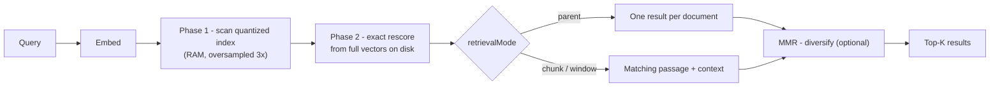

# MDDB 2.11.4: tenants, better RAG answers, and vectors that stopped hogging your RAM

We spent the last cycle reading a lot of feedback — not just about MDDB, but
about what people using vector databases in general keep running into. A few
themes came up again and again: "I want to put multiple customers on one
instance without building isolation myself", "my RAG answers quote the right
document but the wrong part of it", "my top-10 results are the same paragraph
ten times", and the evergreen "why does this need so much RAM?"

Version 2.11.4 is our answer to all four. Here's the tour.

## One server, many tenants, zero new concepts

If you're building a SaaS product on MDDB, you used to have two options:
run one server per customer, or write your own isolation layer. Both work.
Neither is fun.

Now you can create a user with a `tenant`, and that's the whole setup:

```bash
curl -X POST /v1/auth/register \
  -d '{"username":"alice","password":"…","tenant":"acme"}'
```

Alice can only see collections named `acme/…`. Not "shouldn't see" — *can't*
see. The check lives in the one authorization gate that every handler already
goes through, so HTTP, gRPC, GraphQL and MCP all inherit it automatically,
and so does every endpoint we add in the future. Tenant users can never hold
the global admin role, listings only show their own namespace, and a
wildcard permission means "everything in *my* tenant" — which gives you a
tenant admin for free.

The part we're most pleased with: if you run single-tenant, nothing changes.
No migration, no config, no new failure modes. Existing deployments won't
notice 2.11.4 happened.

## RAG that quotes the paragraph, not the book

MDDB has always embedded documents chunk by chunk, but search results came
back as whole documents. Fine for humans browsing; wasteful when you're
assembling an LLM prompt and every token counts.

`retrievalMode` gives you three answers to "what should a result be?":

- **`parent`** (default) — one result per document, exactly as before.
- **`chunk`** — the actual matching passage, with `chunkIndex` and
  `chunkText` ready to paste into a prompt.
- **`window`** — the passage plus its neighbors, when a lone chunk is too
  little context.

A detail we care about: passages are re-derived from the parent document's
current content at query time, so they can never drift out of sync with an
edited document. Delete the document, and its chunks are gone too.

And for the "same paragraph ten times" problem, there's now `"mmr": true` —
Maximal Marginal Relevance reranking. It picks results one by one, each time
weighing "how relevant is this?" against "how similar is this to what I
already picked?". One knob (`mmrLambda`) slides between pure relevance and
maximum diversity.

Here's the whole journey of a query now, including a stop we'll explain in a
moment:



## Big archive, small server

Quantization (int8/int4) already shrank stored vectors. But the in-memory
index still kept full-precision float32 vectors around — so your RAM bill
didn't actually go down much.

`diskOnlyVectors: true` finishes the job. RAM holds *only* the quantized
representation; the full-precision vectors live on disk and are batch-read
to exactly rescore the candidates from phase 1 (that's the two-phase flow in
the diagram above). You get roughly **4× less vector memory with int8, 8×
with int4**, at the cost of one extra disk read per query — typically well
under a millisecond. For a 100K-document archive at 1536 dimensions, that's
~600 MB of resident vectors down to ~150 MB.

If you're running MDDB on a small VPS or an edge box next to a large
archive, this one's for you.

Bonus for Apple Silicon and ARM servers: we also fixed a build issue that
had silently disabled the NEON/SME hardware acceleration for vector math.
It's back on, no flags needed.

## See your embedding space

Embeddings are invisible, which makes them hard to debug. "Why did *that*
document match?" usually meant exporting vectors to a notebook.

The panel now has a **Vector Space** view: a 2D projection of a collection's
embeddings, computed server-side (plain PCA, deterministically sampled, no
external libraries). Chunks of the same document share a color, clusters are
visible at a glance, and outliers stick out — literally. Type a query and
it's projected into the same map as a crosshair, so you can *see* why it
lands near some documents and far from others.

It's a small feature, but it turns a class of "huh?" moments into a
ten-second look.

## The fine print

- Everything above ships in one release, each feature opt-in, nothing
  breaking. Full details: [multi-tenancy](/docs/multi-tenancy/),
  [search & retrieval modes](/docs/search/),
  [quantization & disk-only mode](/docs/quantization/).
- 2.11.4 also folds in the 2.11.3 changes (Docker and dependency sweep) that
  were merged but never shipped as a release.
- The docs got a large sweep too: the gRPC and GraphQL references now cover
  everything the server actually implements, and all 79 built-in MCP tools
  are cataloged in one place.

Upgrade is the usual: pull the new binary or image, restart. Your data and
config carry over untouched.

Happy building — and if one of these features unblocks something you're
working on, we'd genuinely like to hear about it.
