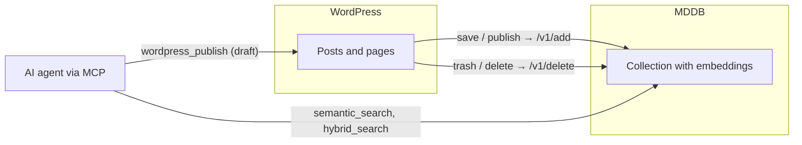

# Your WordPress just became AI-searchable: meet the MDDB Sync plugin

There's a decade of knowledge sitting in your WordPress. Product announcements,
how-to guides, changelogs, that one post from 2019 that still answers half of
your support tickets. And when you plug an AI agent into your company, the
first thing it asks is, effectively: *where's the knowledge?*

The **MDDB Sync** plugin answers that with a two-way bridge: WordPress content
flows into MDDB where it becomes semantically searchable, and — if you opt in —
your AI agent can write drafts back into WordPress through MDDB's MCP tools.



## What it actually does

The plugin is deliberately boring — a thin, security-first PHP shim with no
background queue, no JavaScript build step, no dashboard widgets:

- **On save or publish**, the post is converted to Markdown and upserted into
  MDDB (`POST /v1/add`) under a stable key, so edits update the same document.
- **On trash or delete**, the matching MDDB document is removed. Your index
  never drifts out of sync with the site.
- **Language aware** — it reads the post language from Polylang or WPML (or
  falls back to the site locale), so multilingual sites land in MDDB with
  correct per-language keys.
- **Self-updating** from GitHub Releases — no marketplace slug needed.

## Setup in ten minutes

**1. Install the plugin.** Download `mddb-sync-<version>.zip` from the
[MDDB releases page](https://github.com/tradik/mddb/releases) (tags starting
with `wp-v`), then in wp-admin: *Plugins → Add New → Upload Plugin → Activate*.

**2. Point it at your MDDB.** Under *Settings → MDDB Sync* set:

- **MDDB URL** — e.g. `https://mddb.example.com` (`https://` is required so
  your API key never travels in cleartext; plain `http://` is allowed only for
  localhost development),
- **API key** — an MDDB key sent as a Bearer token,
- **Collection** — defaults to your site host (`example_com`), one collection
  per site.

Hit **Test connection** — it performs a real search against your MDDB and
reports the HTTP status. Green means go.

**3. Publish something.** Save any post and it's in MDDB. Verify from a
terminal:

```bash
curl -X POST https://mddb.example.com/v1/vector-search \
  -H "Authorization: Bearer $MDDB_KEY" \
  -d '{
    "collection": "example_com",
    "query": "how do we handle refunds?",
    "topK": 3,
    "retrievalMode": "chunk"
  }'
```

With `retrievalMode: chunk` you get back the exact matching passage of the
post (`chunkText`), not just the whole article — which is precisely what you
want to paste into an LLM prompt. Ten-year-old support wisdom, retrieved in
milliseconds.

## The interesting direction: letting the agent write back

Since plugin 0.2.0 the bridge runs both ways. Enable **Remote publishing
(MCP)** in the plugin settings — it generates a dedicated publish key and
opens two authenticated REST routes on your site. Then tell MDDB where your
WordPress lives, per collection:

```bash
curl -X PUT https://mddb.example.com/v1/collection-config \
  -H "Authorization: Bearer $MDDB_KEY" \
  -d '{
    "collection": "example_com",
    "wordpress": {
      "url": "https://blog.example.com",
      "apiKey": "<publish key from the plugin>"
    }
  }'
```

From that moment, any MCP-connected agent (Claude, Cursor, or anything else
speaking MCP) has two new abilities scoped to that collection:

- **`wordpress_publish`** — create or update a post or page, including tags,
  categories, custom taxonomies, meta fields and Polylang/WPML translations;
- **`wordpress_set_status`** — publish, unpublish or trash an existing post.

A realistic workflow, in plain words to your agent:

> "Search our `example_com` collection for everything we've written about the
> v2 API migration, write an updated summary post, and put it in WordPress as
> a **draft** tagged `api` and `migration`."

The agent retrieves with `semantic_search`, writes, and calls
`wordpress_publish` with `status: draft`. A human reviews in wp-admin and
clicks Publish. The agent does the legwork; the editorial control stays with
you.

## Security posture, briefly

The write-back path is **off by default**, gated by a separate publish key
(not your MDDB API key), and every inbound request is authenticated before it
touches WordPress. The sync path sends your API key only over TLS. And MDDB's
side respects collection permissions — an agent scoped to one collection
publishes to that site only.

## Try it

- Plugin install & full settings reference:
  [integrations/wordpress-plugin](https://github.com/tradik/mddb/tree/main/integrations/wordpress-plugin)
- MCP publishing tools: [MCP docs](/docs/mcp/)
- Retrieval modes used above: [Search docs](/docs/search/)

If you wire your WordPress into an agent with this, we'd love to hear what it
digs up from your archives.
