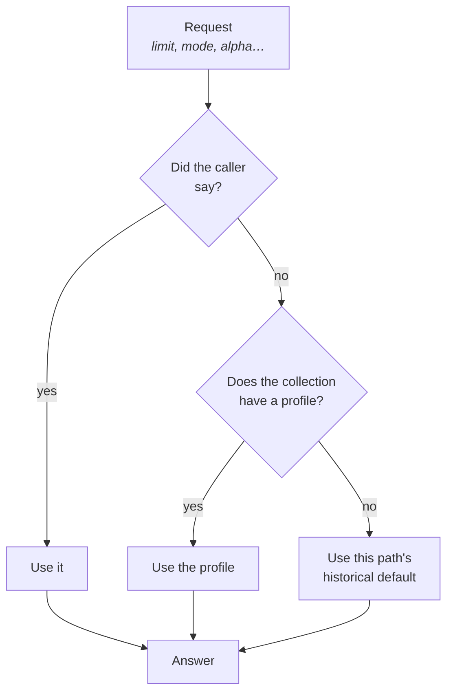

Somewhere in your codebase there is a constant that says `topK = 5`.

It was right once. Then you added a runbooks collection where five results is
never enough, and an API-reference collection where five is already three too
many. So the constant became a parameter, and now every caller passes it — your
chat widget, your CLI script, the MCP agent, and the intern's notebook that
nobody remembers writing.

They do not agree. They were never going to.

## The thing that was always in the wrong place

Look at what a client has to know to search a collection well:

- how many results to ask for
- whether a result should be a document, a chunk, or a chunk with its
  neighbours
- whether to weight keywords or vectors, and by how much
- how much context the answer is allowed to occupy
- how the answer should be formatted once it has it

Every one of those is a property of **the collection**, not of the caller. A
runbook wants numbered steps and a wide net. API documentation wants code blocks
and a tight one. That does not change because the question arrived over MCP
instead of HTTP.

Yet all five lived in client code. Add a sixth consumer and it starts wrong,
and stays wrong until someone notices the answers are worse than they should
be — which, with RAG, can take a very long time.

## Put it with the data

MDDB 2.12 gives a collection a retrieval profile and a response prompt:

```bash
curl -s -X PUT localhost:11023/v1/collection-config -d '{
  "collection": "runbooks",
  "retrieval": {
    "defaultSearchType": "hybrid",
    "topK": 12,
    "retrievalMode": "window",
    "hybridStrategy": "alpha",
    "hybridAlpha": 0.6,
    "hybridAlphaSet": true,
    "contextTokenBudget": 6000,
    "oversample": 4
  },
  "responsePrompt": "Answer as numbered steps. Name the exact command to run. If a step needs elevated access, say so before the command."
}'
```

Now a caller that asks for nothing gets the collection's answer:

```bash
# no limit, no mode, no alpha
curl -s -X POST localhost:11098/mcp -d '{
  "method":"tools/call",
  "params":{"name":"full_text_search",
            "arguments":{"collection":"runbooks","query":"restart"}}}'
```

```
returned: 12   (the profile says topK=12)
```

And a caller that does ask still wins:

```
limit: 3  →  returned: 3
```

That precedence is the whole design, and it is worth stating plainly:



**Request beats profile beats default.** A collection profile is a better
default, never an override — so nothing you already run changes behaviour, and
a caller that knows what it wants is never argued with.

### The zero problem

One detail that looks like pedantry and is not. `hybridAlpha: 0` means "pure
keyword search" — a real, useful setting. It is also what an absent field looks
like in JSON.

So the profile carries `hybridAlphaSet` alongside it. Without that flag, the
only way to configure pure keyword search would be to write a zero that the
server reads as "unspecified" and quietly replaces with 0.5. You would have
configured the opposite of what you asked for, and nothing would have told you.

## The instruction travels with the results

The second half matters more than it sounds. `responsePrompt` is how answers
from this collection should be shaped, and it comes back **attached to the
search results**:

```json
{
  "results": [ … ],
  "total": 3,
  "contextTruncated": true,
  "responsePrompt": "Answer as numbered steps. Name the exact command to run. If a step needs elevated access, say so before the command."
}
```

One call. The agent asked a question and got back both the evidence and the
house style for presenting it. No second round trip, no configuration file on
the agent's side, no "we told the team about this in Slack six months ago".

It expands the same template variables the automation rules use, so the
instruction can refer to the question it is answering:

```json
"responsePrompt": "Answer the question \"{{query}}\" using only the {{collection}} runbooks. Numbered steps, exact commands."
```

```
→ Answer the question "how do I restart svc-7" using only the runbooks
  runbooks. Numbered steps, exact commands.
```

A second template syntax would have been a second thing to document and a
second thing to get subtly wrong, so there isn't one.

And it is plain text for a model, never rendered as markup — capped at 4 KiB,
because this text is prepended to prompts automatically and an unbounded value
would eat the context budget the answer needs. You would see a worse answer
rather than an error, which is the worst way for a limit to be missing.

## The budget that stops an answer eating its own context

`contextTokenBudget` caps how much text a search hands back. Set it to 6000 and
a search that would have returned twelve long documents returns as many as fit,
with a flag saying so:

```json
{ "total": 3, "contextTruncated": true }
```

Two deliberate choices here.

**`total` describes what you received**, not what was found before the cut. A
count that includes dropped results is worse than no count — it tells the caller
it has twelve things when it is holding three.

**Tokens are approximated as bytes÷4**, not tokenised. A real tokeniser would
tie the budget to one model family, and this is a guard rail rather than
accounting. If you need exactness, you need it in your own prompt assembly
anyway.

A confession about this one: the budget shipped on the HTTP, hybrid and vector
handlers and on **none of the MCP paths** — which is to say, it worked
everywhere except for the callers it was written for. We found it while
producing the examples for this post: the same collection, capped at 40 tokens,
returned two results over HTTP and twelve over MCP. Fixed in this release,
along with a test that runs both and compares them.

## What each knob is for

| Setting | Reach for it when |
|---|---|
| `topK` | The right number of results differs per collection — a runbook set needs breadth, an API reference needs precision. |
| `retrievalMode` | `parent` for browsing, `chunk` for prompt assembly, `window` when a lone passage is too little context. |
| `hybridStrategy` / `hybridAlpha` | Your corpus leans keyword (exact identifiers, error codes) or semantic (prose, questions). |
| `contextTokenBudget` | You are feeding a model with a fixed window and would rather truncate deliberately than discover the limit at inference time. |
| `oversample` | Recall is short: the index is asked for this many candidates per requested result, before dedup and rescoring trim them. |
| `defaultSearchType` | You want to tell clients which search this collection expects. MDDB does not reroute your request because of it — it is advice, not a redirect. |
| `responsePrompt` | Answers from this collection have a house style, and you are tired of every client reimplementing it. |

## What we deliberately left out

**Cross-collection search takes no profile.** It has no single collection whose
profile could own `topK`, and quietly picking one of them would be a decision
nobody could predict. It keeps its own defaults.

**`defaultSearchType` does not reroute anything.** It tells a client what this
collection expects; the server does not silently send your `fts` request to the
vector index because the config said `hybrid`. A request that goes somewhere
other than where it was addressed is a debugging session waiting to happen.

**A collection with no profile behaves exactly as it did in 2.11.** No
migration, no defaults appearing under you. `retrieval` is absent, and every
search path keeps the default it has always had.

## Two smaller things in the same area

While we were here:

- **Query embeddings are cached** (`RAG-003`). The same question asked twice
  does not pay for two embedding calls, and a reindex reuses the embedding of
  any chunk whose content has not changed. On a large collection where most
  documents were untouched, that is most of the work not being done.
- **`profile: "fast"` on ingest** (`RAG-004`) names a trade-off that used to be
  four separate flags people set inconsistently. It buys throughput with
  parsing fidelity and bookkeeping, and — this is the part that matters — the
  response tells you which profile actually applied, so a corpus loaded months
  ago can be explained without guessing.

## Try it on one collection

You do not have to adopt this everywhere. Pick the collection whose answers
annoy you most:

```bash
# what does it think right now?
curl -s "localhost:11023/v1/collection-config?collection=runbooks"

# set what you actually want
curl -s -X PUT localhost:11023/v1/collection-config -d '{
  "collection": "runbooks",
  "retrieval": { "topK": 12, "retrievalMode": "window" },
  "responsePrompt": "Numbered steps. Exact commands. Flag anything needing sudo."
}'
```

Then stop passing `topK` from your client and see whether the answers get
better. If they do, that constant was in the wrong place — and now there is a
right place to put it.

Full reference: [RAG pipeline](/docs/rag-pipeline/) and
[configuration](/docs/config/).
