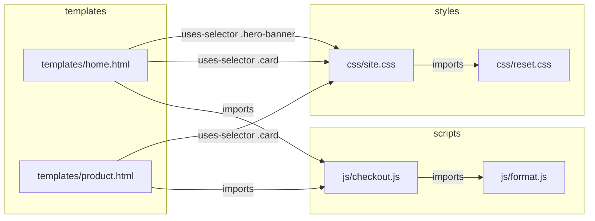

You are about to rename a CSS class. You grep for it, get forty hits, and spend
the next twenty minutes deciding which ones matter. Most are the same string in
a different context: the stylesheet that declares it, six templates that apply
it, a changelog entry from two years ago, and a comment saying "do not use".

Grep found every occurrence. You wanted every *dependency*. Those are different
questions, and text search cannot tell them apart.

MDDB 2.12 can.

## The problem with searching code as prose

Full-text search ranks by how often a term appears and how rare it is across
the corpus. That is the right model for prose and the wrong one for code.

Here is what it does to a small theme. `.hero-banner` is declared once, in the
stylesheet, and applied once, in a template:

```bash
curl -s -X POST localhost:11023/v1/fts \
  -d '{"collection":"theme","query":"hero-banner"}'
```

```
css/site.css           0.610
templates/home.html    0.569
```

Close scores, and only luck put the stylesheet on top. Add a second template
that mentions the class three times and it drops to second — because repetition
is what TF-IDF rewards, and a template that *uses* a selector repeats it more
than the stylesheet that *declares* it.

The declaration is the thing you were looking for. It ranked by accident.

## Three lists per document

When a document is saved to a collection with a code language, MDDB now reads
its content and records three things in ordinary metadata:

- **`defines`** — what this file declares. CSS selectors and their component
  classes and ids, custom properties, JS function/class/const names, HTML ids.
- **`uses`** — what it applies without declaring. The classes on an element,
  a `var(--token)` reference.
- **`imports`** — what it pulls in by path: `<script src>`, `<link href>`,
  `@import`, an ES `import`.

Save a stylesheet and look at what came back:

```bash
curl -s -X POST localhost:11023/v1/get \
  -d '{"collection":"theme","key":"css/site.css","lang":"en"}'
```

```json
"meta": {
  "defines": ["#checkout-form", "--brand", ".card", ".card .price",
              ".hero-banner", ".hero-banner .title", ".price",
              ".title", ":root"],
  "imports": ["css/reset.css"],
  "uses": ["reset.css"],
  "language": ["css"]
}
```

No new query surface came with this. `defines`, `uses` and `imports` are values
in the same flat metadata map that already backs `meta.*` filters, so the
question "who declares this selector?" is answered by machinery that shipped
years ago:

```bash
# who declares it — one answer
curl -s -X POST localhost:11023/v1/search \
  -d '{"collection":"theme","filterMeta":{"defines":[".hero-banner"]}}'
# → css/site.css

# who applies it — the list you actually act on
curl -s -X POST localhost:11023/v1/search \
  -d '{"collection":"theme","filterMeta":{"uses":[".hero-banner"]}}'
# → templates/home.html
```

Two exact answers where full-text search gave you two fuzzy ones.

### One detail worth knowing

The extractor walks CSS as source, not line by line. That sounds like a
footnote until you feed it a minified stylesheet — where the entire file is one
line. An earlier line-anchored version of this found **1 of 200 rules** in a
minified file and reported success. There is now a test named
`TestMinifiedStylesheetFindsEveryRule`, which exists because that bug did.

## From lists to a graph

Three lists per document are already useful. What makes them answer real
questions is that one document's `uses` matches another's `defines`, and one
document's `imports` matches another's key. That is an edge, and walking those
edges is the `/v1/code-graph` endpoint.



Nothing in that picture is stored. Every edge is derived at query time from the
metadata index. That was a deliberate choice: an edge is a statement about two
documents, so storing it means keeping one copy per side — and the day someone
edits only one file, the two copies disagree and nothing notices. Deriving them
means a reindex reproduces the graph exactly, and a deleted document takes its
edges with it.

### Ask it the three questions

**"What breaks if I change this stylesheet?"** — follow edges inward:

```bash
curl -s "localhost:11023/v1/code-graph?collection=theme&key=css/site.css&direction=in"
```

```
templates/home.html      --uses-selector:.card--> css/site.css
templates/home.html      --uses-selector:.hero-banner--> css/site.css
templates/home.html      --uses-selector:.price--> css/site.css
templates/home.html      --uses-selector:.title--> css/site.css
templates/product.html   --uses-selector:.card--> css/site.css
templates/product.html   --uses-selector:.price--> css/site.css
templates/product.html   --uses-selector:.title--> css/site.css

truncated: false
```

Seven edges, and each one names the symbol that justifies it. That matters more
than it looks: "home.html and site.css are related" is not something you can
act on. "home.html applies `.hero-banner`, `.card`, `.price` and `.title`" tells
you exactly which four things to check.

**"Which pages load this script?"**

```bash
curl -s "localhost:11023/v1/code-graph?collection=theme&key=js/checkout.js&direction=in"
```

```
templates/home.html      --imports--> js/checkout.js
templates/product.html   --imports--> js/checkout.js
```

Import paths resolve the way a browser resolves them — relative to the document
doing the importing. `href="../css/site.css"` inside `templates/home.html`
resolves to `css/site.css`. Bare specifiers are treated per language: in
JavaScript a bare name is a package, in HTML and CSS it is a path relative to
the document. The two behave differently because they *are* different, and an
earlier version that treated them alike produced no edges at all for `<link>`
and `@import`.

**"What does this file depend on?"** — follow edges outward, and ask for lines:

```bash
curl -s "localhost:11023/v1/code-graph?collection=theme&key=js/checkout.js&direction=out&lines=true"
```

```json
{
  "from": "js/checkout.js",
  "to": "js/format.js",
  "kind": "imports",
  "symbol": "js/format.js",
  "direction": "out",
  "lines": { "fromLine": 1 }
}
```

`lines=true` is the only part of a traversal that reads document content, which
is why it is opt-in rather than always on. When you want it, it turns a file
name into a place to put your cursor.

## Bounded on purpose

A popular selector like `.title` is applied by nearly every template you own.
An unbounded walk from it returns your whole theme, slowly, and tells you
nothing.

So the walk has limits, and they are visible:

| Knob | Default | Ceiling |
|---|---|---|
| `depth` | 1 | 3 |
| `maxDegree` | 100 | 100 |
| `direction` | `both` | — |

And every response carries `truncated`. That flag is the point of the whole
design. **"Nothing depends on this file" is only safe to act on when the walk
was complete** — otherwise you are reading "nothing depends on this *within the
first hundred neighbours I looked at*", which is a different sentence with the
same shape. Deleting code on the strength of the second one is how you find out.

## Where you can call it

Three surfaces, one implementation:

- `GET`/`POST /v1/code-graph`
- the `code_graph` MCP tool, annotated read-only — so an agent on a
  read-only server can traverse your codebase and cannot touch it
- the `codeGraph` GraphQL query

A test pins that all three return the same graph for the same input, because
three implementations of one feature is how the third one quietly starts
lying.

## What this is not

It is not a compiler, and it does not pretend to be. It reads what a file says
about itself: the selectors in its stylesheet, the classes on its elements, the
paths in its imports. That is enough for the questions above and not enough for
"is this variable ever actually read at runtime". A dynamically composed class
name (`"card--" + variant`) is invisible to it, the same way it is invisible to
your grep.

What you get is a much better first draft of the answer, with the symbol that
justifies each edge attached — so checking it takes seconds instead of
twenty minutes.

## Try it

Point it at a theme you already have:

```bash
# ingest a directory of CSS/HTML/JS as a code collection
mddb-cli add theme css/site.css en --file css/site.css --meta 'language=css'

# then ask
curl -s "localhost:11023/v1/code-graph?collection=theme&key=css/site.css&direction=in&lines=true"
```

The full reference — every edge kind, the resolution rules per language, and
what the extractor reads from each — is in the
[API documentation](/docs/api/).

If you find a shape it gets wrong — a framework convention it does not read, a
path scheme it resolves badly — that is worth an issue. The extractor is
deliberately small, and the things it misses are mostly things nobody has told
it about yet.
