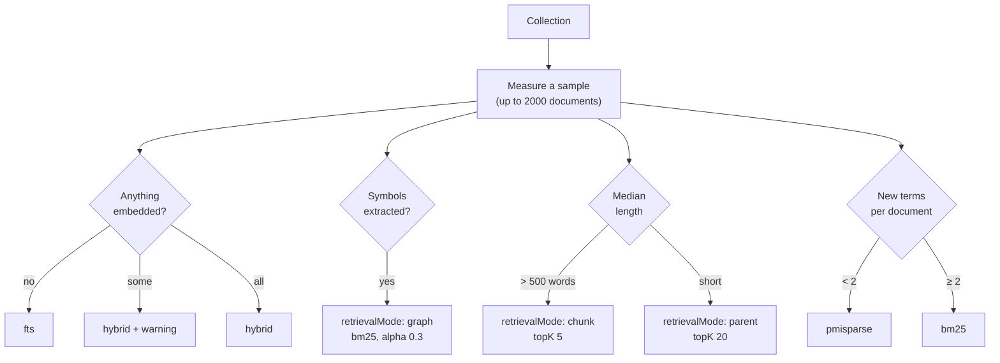

Before this release, an LLM connected to MDDB had no useful basis for choosing
a search algorithm. It could accept the default or guess from the name.

That became harder to ignore after we added a 4-bit vector index and a new
fusion strategy. MDDB now exposes eight vector algorithms, four ranking
algorithms, three fusion strategies and four retrieval modes. These settings
affect recall, memory use and the shape of the returned context, but the tool
schema alone does not explain their trade-offs.

## What an agent actually sees

```
vectorAlgorithm: "flat" | "hnsw" | "ivf" | "pq" | "opq" | "sq" | "sq4" | "bq"
algorithm:       "tfidf" | "bm25" | "bm25f" | "pmisparse"
strategy:        "alpha" | "rrf" | "weighted"
retrievalMode:   "parent" | "chunk" | "window" | "graph"
```

That is 19 names without enough context to choose between them. Documentation
helps a developer, but an agent normally sees the tool schema and the request.
It does not read the search guide before every query.

## Signals available in the collection

Much of the answer can be estimated from the collection itself.

Whether documents are embedded decides whether vector search is possible at
all. Document length decides whether returning whole documents wastes a prompt.
Vocabulary decides whether keyword ranking can tell documents apart. The
presence of extracted symbols says this is code, where the connection graph
reaches files no score would find. Vector volume decides whether quantization is
worth the recall it costs.

The advisor obtains those signals by reading a sample of up to 2000 documents.

```bash
curl -s "$MDDB/v1/search-advisor?collection=theme"
```



## Three collections, three answers

The same server can therefore recommend different settings for different
collections:

| Collection | What it is | Recommendation |
|---|---|---|
| A theme | 4 files of CSS/JS/HTML, 7 words median, all carrying symbols | `bm25` + `retrievalMode: graph` |
| Manuals | 120 documents, 902 words median, 0.18 new terms each | `pmisparse` + `chunk` + topK 5 |
| Status notes | 200 documents, 8 words median | `bm25` + `parent` + topK 20 |

## Reasons in the response

The response includes a reason for each recommendation:

```json
{
  "searchType": "fts",
  "ftsAlgorithm": "pmisparse",
  "retrievalMode": "chunk",
  "topK": 5,
  "reasons": [
    "No embedding provider is configured and no document has a vector, so keyword search is the only search available.",
    "pmisparse for ranking: each document adds only 0.2 new terms to the vocabulary, so the documents look alike to an exact-match ranker and query expansion is what recovers the matches it misses.",
    "retrievalMode chunk: 100% of documents are over 500 words, and returning whole ones would spend a prompt on paragraphs nobody asked about.",
    "topK 5: the documents are long, so few of them fill a context window."
  ]
}
```

The explanation is important because the advisor measures the corpus, not the
queries users will send later. A recommendation can be reasonable for the
sample and still be wrong for the actual workload. The reasons make that
disagreement visible before the profile is applied.

It also warns rather than silently working around a problem:

> Only 41% of documents are embedded; the rest can only be found by keyword.
> Reindex before relying on vector recall.

Partial vector coverage can otherwise be easy to miss: searches still return
results, but documents without vectors depend entirely on the keyword side.

## Choosing a vocabulary metric

The obvious metric is **type-token ratio**: distinct words divided by total
words. A low value can indicate repetitive text, where exact keyword ranking
has less information with which to separate documents.

Pooled TTR falls as a corpus grows. The token count increases roughly with the
amount of text, while vocabulary grows more slowly. The same kind of prose can
therefore produce very different TTR values at 100 and 100,000 documents. Used
as a fixed threshold, it would classify many large collections as repetitive.

The advisor uses a coarser measure instead: **distinct vocabulary divided by
the number of sampled documents**. It can be read as the average vocabulary
contribution per document in that sample:

| Collection | New terms per document | Reading |
|---|---|---|
| Status notes ("service healthy", ×200) | 0.02 | Documents are near-identical |
| Manuals from a 20-word vocabulary | 0.18 | Repetitive |
| A theme's source files | 5.0 | Varied |
| English technical prose | 8–15 | Varied |

This ratio is not mathematically independent of corpus size; vocabulary also
grows more slowly than the document count. It is used as a practical heuristic
over the advisor's fixed-size sample, not as a general measure of linguistic
diversity. The first implementation used pooled TTR and printed `0% distinct
terms` for a real collection. That result prompted the change.

## Applying the recommendation

The recommendation comes back with a `retrievalProfile` attached — the same
per-collection profile MDDB already uses. It can be stored so clients that use
collection defaults inherit the profile:

```bash
curl -s "$MDDB/v1/search-advisor?collection=runbooks&apply=true"
```

Applying the recommendation merges it into the existing collection
configuration. It does not replace unrelated settings such as the response
prompt or encryption flag.

## For agents

The same thing is an MCP tool, annotated read-only:

```json
{
  "name": "search_advisor",
  "annotations": { "readOnlyHint": true, "destructiveHint": false }
}
```

An agent can call it once per collection before its first search instead of
choosing from the algorithm names alone.

And in the panel, it is a button:

> **Search Advisor** → pick a collection → **Measure** → see what it found, what
> it recommends, and why → **Apply to collection**

## What it does not do

The default advisor call is read-only. Configuration changes require the
explicit `apply=true` HTTP option or a separate configuration write.

It does not inspect query logs or evaluate relevance against labelled queries.
For example, a prose collection may still receive mostly exact-identifier
queries, in which case its recommended alpha may be unsuitable.

The implementation is a set of documented heuristics rather than a trained
model. Its output should be treated as a starting profile and checked against
real queries.

---

Full reference: [search algorithms](/docs/search/). The advisor lives at
`/v1/search-advisor`, as the `search_advisor` MCP tool, and over gRPC. The gRPC
method was added when the LangChain adapter needed access to the same advice.
