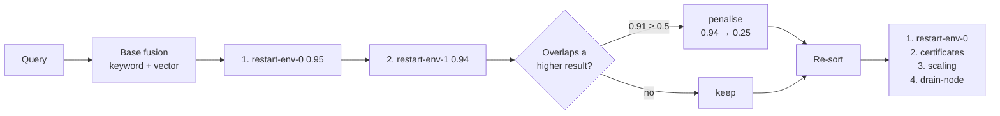

A top-five search can return five results containing only three distinct texts.
This happens when a corpus contains documents copied for another environment,
customer or version and edited only slightly.

The ranking can be correct for each result while the result set is still poor:
several high-scoring slots carry the same information.

## Why similarity cannot fix this

Near-copies have near-identical embeddings. That is what makes them near-copies.
When a query matches one copy, it usually matches the others at almost the same
score. A normal top-k selection evaluates every document independently, so it
has no reason to reserve slots for different information.

Here is what that looks like on a runbook that was forked per environment:

```
0.95  runbooks/restart-env-0.md    "restart the service by running systemctl…"
0.94  runbooks/restart-env-1.md    "restart the service by running systemctl…"
0.93  runbooks/restart-env-2.md    "restart the service by running systemctl…"
0.92  runbooks/restart-env-3.md    "restart the service by running systemctl…"
0.90  runbooks/certificates.md     "rotate the certificate with certbot renew…"
0.89  runbooks/scaling.md          "scale the deployment by editing replicas…"
```

With `topK: 4`, all four slots describe the same restart procedure while the
other useful results remain below the cut.

## What a keyword score does about it

TF-IDF and BM25 have the same limitation. Near-copies contain nearly the same
terms at similar frequencies, so their scores tend to cluster together.

Both halves of hybrid search answer how well each document matches the query.
Neither measures how much new information a result adds to those already
selected, so `alpha` and `rrf` alone do not solve the problem.

## Measuring textual overlap

The diversity signal measures how much text two documents share.

MDDB estimates this with MinHash. It splits each document into overlapping runs
of three consecutive words and builds a 128-value signature. Agreement between
two signatures estimates the Jaccard overlap of their shingle sets.

Building a signature depends on document length. Comparing two completed
signatures takes a fixed 128 comparisons, regardless of the source documents'
lengths.

The useful property is that textual overlap can disagree with semantic
similarity:

| Pair | Expected embedding similarity | Example text overlap |
|---|---|---|
| A document and its own copy | Very high | **1.00** |
| A document with two words changed | Very high | **0.83** |
| Two independent pages on certificate rotation | High | **0.04** |
| Two unrelated pages | Low | **0.00** |

Two independently written pages about certificate rotation may be semantically
close while sharing few three-word sequences. MinHash can therefore separate a
copied page from another page about the same subject.

Our test for it is named after that:

```go
func TestSameTopicDifferentWordsScoresLow(t *testing.T)
```

## The signal

MDDB 2.12 adds a `weighted` fusion strategy: alpha's blend, then adjusted by
signals the base fusion cannot see.

```bash
curl -s -X POST "$MDDB/v1/hybrid-search" -d '{
  "collection": "runbooks",
  "query": "restart the service",
  "strategy": "weighted",
  "signals": { "diversity": 0.8 }
}'
```

Each result is compared against every result already ranked above it. If it
overlaps one of them past the threshold, its score is reduced in proportion to
the overlap — a heavy rewrite is demoted slightly, a verbatim copy heavily.



Measured on exactly the corpus above — one document forked four ways plus three
distinct answers:

| | Distinct documents in the top 4 |
|---|---|
| Without the signal | **1** |
| `diversity: 0.8` | **4** |

In this test, the signal changes the top four from one distinct answer to four.

## Weight and freshness defaults

**A weight is a fraction of the score.** `proximity: 0.1` means "up to 10%
better". An early test used `0.5`, which allowed a shared directory to outweigh
a much stronger base score. Weights are now documented, clamped to [0, 1], and
covered by a test for that aggressive setting.

**Freshness is off by default**, and should stay off for reference material. An
API specification does not become less true with age, and a decay curve does not
know that.

## Near-duplicate detection

The same overlap estimate is also available for near-duplicate detection.

MDDB already had two duplicate modes. `exact` compares content hashes, so a
one-byte change produces a different hash. `similar` requires an embedding
provider and primarily measures topic, which makes it less suitable for
distinguishing a copied document from an independently written page about the
same procedure.

```bash
curl -s -X POST "$MDDB/v1/find-duplicates" -d '{
  "collection": "runbooks",
  "mode": "minhash",
  "threshold": 0.7
}'
```

This mode finds copied-and-edited documents without treating independently
written pages on the same topic as duplicates. It does not require embeddings.
The ranking signal and duplicate endpoint share the same MinHash package.

MinHash is not included in `mode: "both"`. Unlike the other two modes, it reads
every document body, so enabling it implicitly could make an existing request
substantially more expensive.

## When to reach for it

Diversity is useful for templates filled in per customer, runbooks forked per
environment, documentation versioned by copying, and content received through
multiple imports.

It can remain off for collections where documents are independently authored
and result diversity is not a problem. When enabled, MDDB computes one MinHash
signature per result in the merge window and reuses it for every comparison.

---

Reference: [search algorithms](/docs/search/), section *Weighted (multi-signal
fusion)*. The other two signals — proximity and freshness — are documented
there, along with the `signalBreakdown` the response carries, so what each one
contributed is visible rather than inferred.
