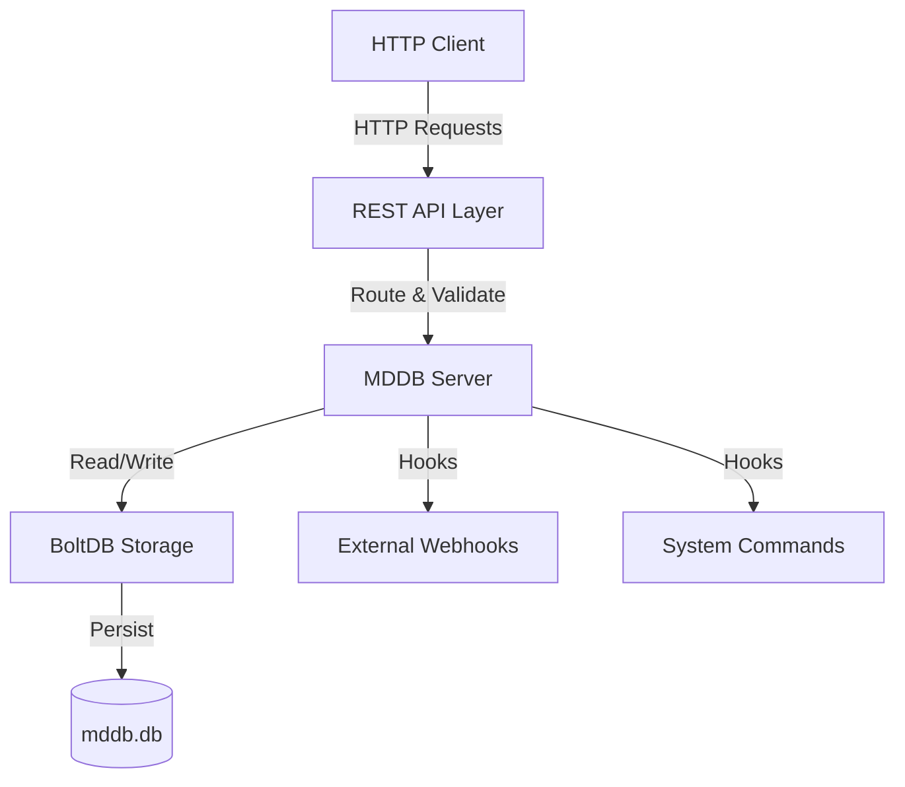
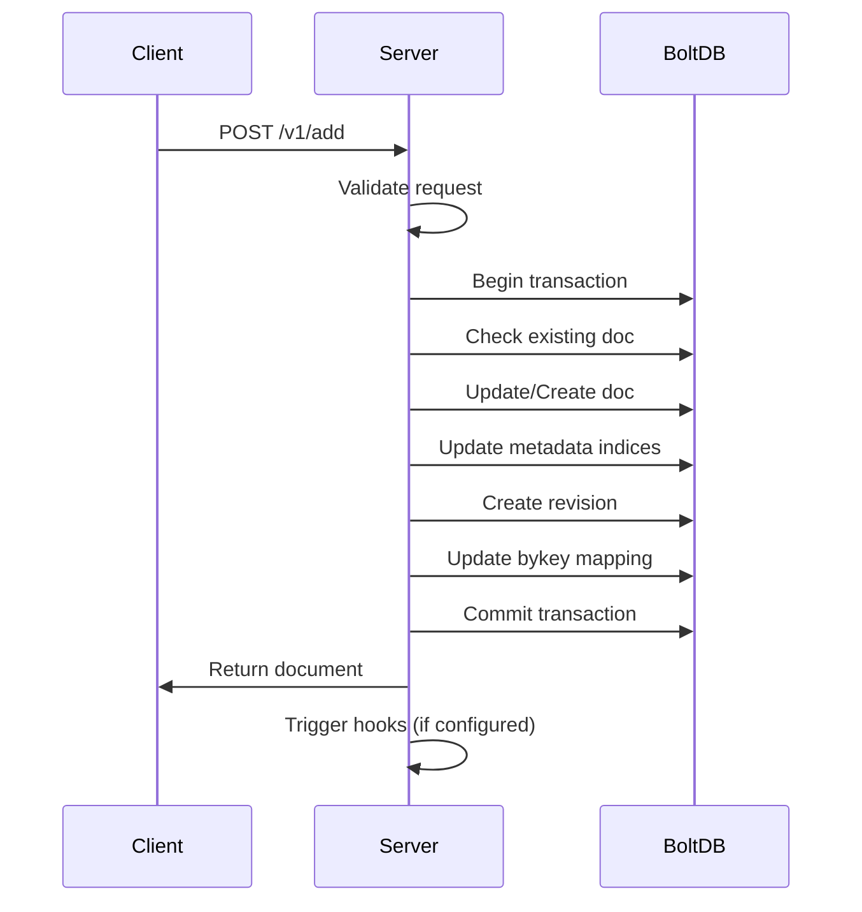
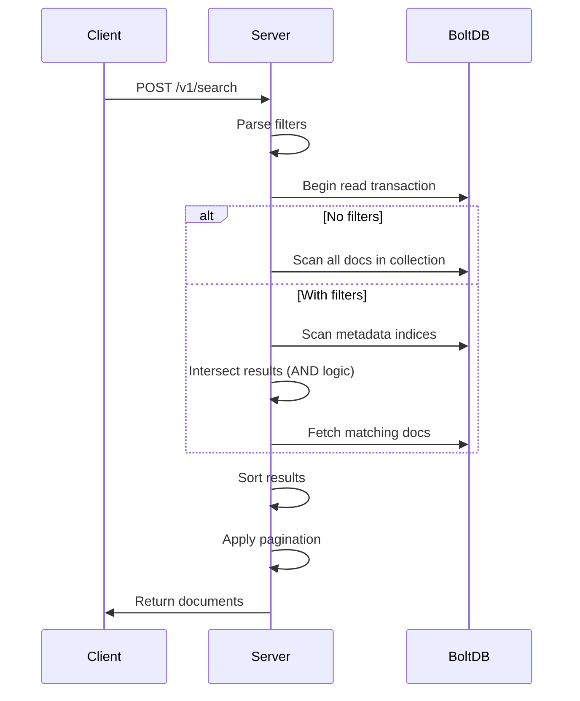
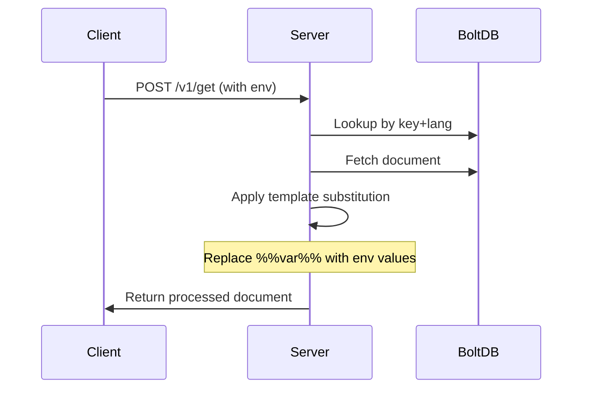

# MDDB Architecture

## Overview

MDDB is a lightweight, embedded markdown database built on top of BoltDB. It provides a RESTful HTTP API for managing markdown documents with metadata, revisions, and full-text capabilities.

## High-Level Architecture



## Components

### 1. HTTP Server Layer

**Responsibilities**:
- Handle incoming HTTP requests
- Route requests to appropriate handlers
- Middleware for JSON responses
- Access mode enforcement (read/write/rw)

**Endpoints**:
- `/v1/add` - Add/update documents
- `/v1/get` - Retrieve documents
- `/v1/search` - Search with filters
- `/v1/export` - Export data (NDJSON/ZIP)
- `/v1/backup` - Create database backup
- `/v1/restore` - Restore from backup
- `/v1/truncate` - Clean up revisions

### 2. Storage Layer (BoltDB)

**Database Structure**:

```
mddb.db
├── docs/          # Current document versions
│   └── doc|{collection}|{docID} → JSON
├── idxmeta/       # Metadata indices
│   └── meta|{collection}|{key}|{value}|{docID} → 1
├── rev/           # Revision history
│   └── rev|{collection}|{docID}|{timestamp} → JSON
└── bykey/         # Key-to-ID mapping
    └── bykey|{collection}|{key}|{lang} → docID
```

**Buckets**:

1. **`docs`**: Stores the latest version of each document
   - Key format: `doc|{collection}|{docID}`
   - Value: JSON-encoded document

2. **`idxmeta`**: Metadata index for fast searching
   - Key format: `meta|{collection}|{metaKey}|{metaValue}|{docID}`
   - Value: `1` (existence marker)
   - Enables prefix scans for metadata queries

3. **`rev`**: Revision history
   - Key format: `rev|{collection}|{docID}|{timestamp}`
   - Value: JSON-encoded document snapshot
   - Sorted by timestamp for easy traversal

4. **`bykey`**: Key-to-ID lookup
   - Key format: `bykey|{collection}|{key}|{lang}`
   - Value: Document ID
   - Enables fast retrieval by key+lang

## Data Flow

### Add/Update Document



### Search Documents



### Get Document with Templating



## Key Design Decisions

### 1. Deterministic IDs

Documents are identified by: `{collection}|{key}|{lang}`

**Benefits**:
- Predictable IDs
- Natural deduplication
- Easy to reason about
- No need for separate ID generation

### 2. Metadata as Multi-Value Maps

Metadata: `map[string][]string`

**Benefits**:
- Flexible schema
- Multiple values per key (tags, categories)
- Easy to query and filter
- Indexed for performance

### 3. Prefix-Based Indexing

Index keys: `meta|{collection}|{key}|{value}|{docID}`

**Benefits**:
- Fast prefix scans in BoltDB
- Efficient range queries
- No need for secondary indices
- Automatic sorting

### 4. Revision History

Every update creates a new revision with timestamp.

**Benefits**:
- Full audit trail
- Point-in-time recovery
- Change tracking
- Can be truncated to save space

### 5. Embedded Database (BoltDB)

**Benefits**:
- No external dependencies
- Single file storage
- ACID transactions
- Fast local access
- Easy backup/restore

**Trade-offs**:
- Single-writer (not an issue for most use cases)
- Not distributed
- Limited to single machine

## Access Modes

### Read Mode (`read`)
- Only GET operations allowed
- Write operations return 403
- Useful for read replicas

### Write Mode (`write`)
- Only write operations allowed
- Rarely used in practice

### Read-Write Mode (`wr`)
- All operations allowed
- Default and recommended mode

## Extension Points

### Hooks System

```go
type Hooks struct {
    PostAddWebhookURL    string   // HTTP webhook after add
    PostAddExec          []string // Command to execute after add
    PostUpdateWebhookURL string   // HTTP webhook after update
    PostUpdateExec       []string // Command to execute after update
}
```

**Use Cases**:
- Trigger builds after content updates
- Send notifications
- Sync to external systems
- Generate static sites
- Update search indices

## Performance Characteristics

### Read Performance
- **Get by key**: O(log n) - BoltDB B+tree lookup
- **Search with metadata**: O(m * log n) - where m = matching documents
- **Full collection scan**: O(n) - linear scan

### Write Performance
- **Add/Update**: O(log n + m) - where m = metadata keys
- **Index updates**: O(k) - where k = number of metadata values

### Storage
- **Document size**: Typically 1-100 KB
- **Metadata overhead**: ~100 bytes per key-value pair
- **Revision overhead**: Full document copy per revision
- **Index overhead**: ~50 bytes per indexed value

## Scalability Considerations

### Vertical Scaling
- BoltDB performs well with SSDs
- Memory-map for faster reads
- Single-writer limitation

### Horizontal Scaling
- Run multiple read-only instances
- Single write instance
- File-based replication
- Consider sharding by collection

### Database Size
- Suitable for: 10K - 1M documents
- Document size: < 1 MB each
- Total DB size: < 10 GB recommended
- Regular revision truncation important

## Security Considerations

### Current State
- No built-in authentication
- No authorization
- No encryption at rest
- No TLS/HTTPS

### Recommendations
1. **Network Security**:
   - Run behind reverse proxy (nginx, Caddy)
   - Use firewall rules
   - Bind to localhost only

2. **Authentication**:
   - Add auth middleware
   - Use API keys
   - Implement JWT tokens

3. **Encryption**:
   - Use TLS termination at proxy
   - Encrypt database file at filesystem level
   - Consider encrypted BoltDB fork

4. **Access Control**:
   - Implement collection-level permissions
   - Add user roles
   - Audit logging

## Monitoring & Observability

### Metrics to Track
- Request rate per endpoint
- Response times
- Database size
- Number of documents
- Number of revisions
- Error rates

### Logging
- Request/response logging
- Error logging
- Audit trail for writes
- Performance logging

### Health Checks
- Database connectivity
- Disk space
- Memory usage
- Response time

## Future Enhancements

### Planned Features
1. **Full-Text Search**: Integration with Bleve or Meilisearch
2. **Authentication**: Built-in API key support
3. **Compression**: Compress old revisions
4. **Streaming**: Stream large exports
5. **Replication**: Built-in replication support
6. **GraphQL**: GraphQL API alongside REST
7. **WebSockets**: Real-time updates
8. **Plugins**: Plugin system for extensions

### Potential Improvements
- Batch operations API
- Transactions API
- Schema validation (JSON Schema)
- Content versioning (git-like)
- Multi-language search
- Markdown rendering API
- Image/asset storage
- Rate limiting
- Caching layer
