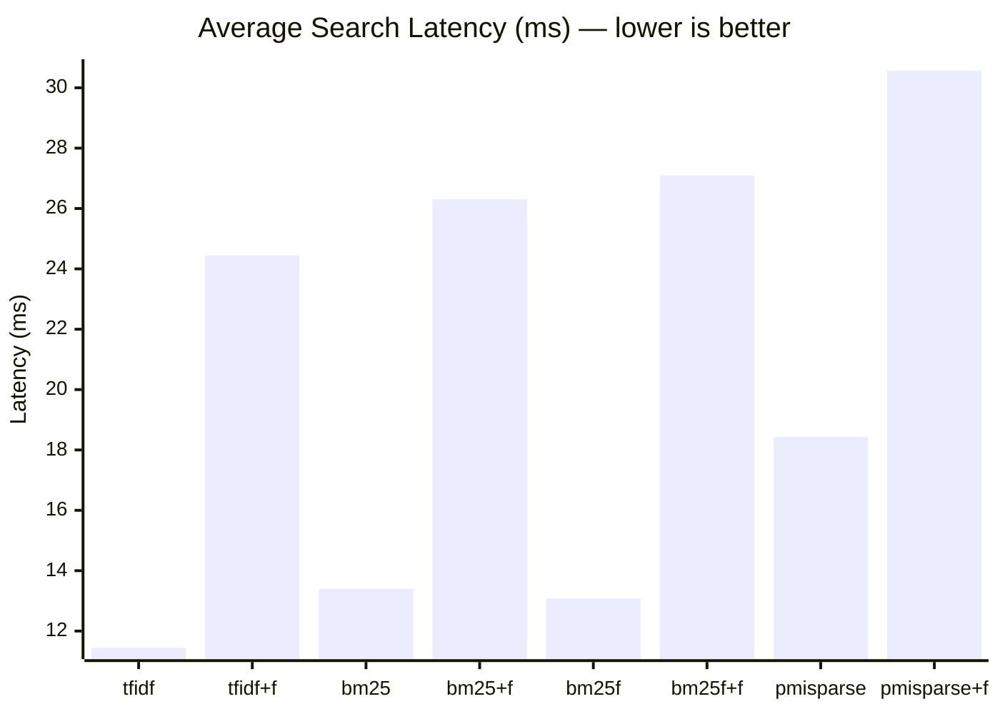
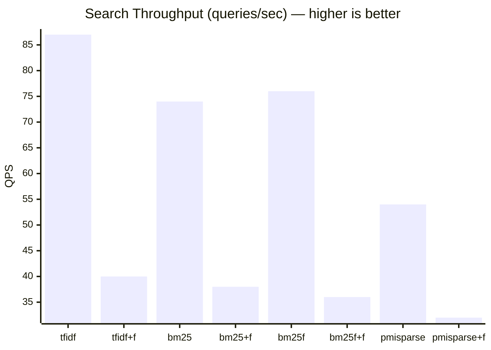
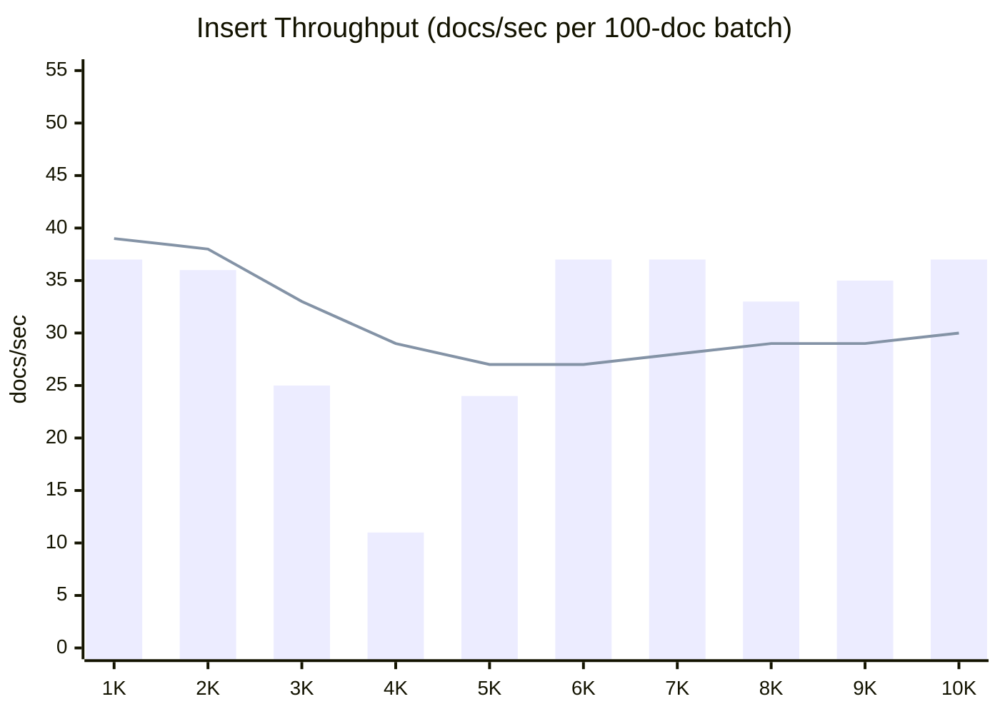

# FTS Algorithm Benchmark

> Auto-generated by `test/search-benchmark.sh` on 2026-03-05 01:13:39

## Environment

| Parameter | Value |
|-----------|-------|
| OS | Darwin 25.3.0 arm64 |
| Go | go1.26.0 |
| Documents | 10000 |
| Queries | 10 diverse queries |
| Iterations | 10 per query per algorithm |
| Runs | 10 (benchmark repeated 10x, results aggregated) |
| Total searches | 1000 per algorithm config |
| Warmup | 5 queries per run (discarded) |

## Algorithms

| Algorithm | Description |
|-----------|-------------|
| **tfidf** | Classic TF-IDF term frequency scoring |
| **bm25** | Okapi BM25 probabilistic ranking with length normalization |
| **bm25f** | BM25F field-weighted scoring (title, meta, content) |
| **pmisparse** | BM25 + PMI query expansion (invented by Tradik Limited) |
| **+fuzzy** | Levenshtein distance 1 fuzzy matching variant |

## Latency Results

| Algorithm | Avg (ms) | P50 (ms) | P95 (ms) | P99 (ms) | Min (ms) | Max (ms) | QPS |
|-----------|----------|----------|----------|----------|----------|----------|-----|
| tfidf | 11.44 | 11.09 | 12.98 | 17.60 | 9.84 | 29.02 | 87 |
| tfidf+fuzzy | 24.44 | 23.71 | 27.34 | 35.54 | 22.39 | 102.60 | 40 |
| bm25 | 13.40 | 12.07 | 16.13 | 35.68 | 10.04 | 224.20 | 74 |
| bm25+fuzzy | 26.31 | 24.87 | 30.44 | 40.56 | 23.03 | 254.57 | 38 |
| bm25f | 13.08 | 12.59 | 16.24 | 18.88 | 10.71 | 26.76 | 76 |
| bm25f+fuzzy | 27.09 | 25.94 | 29.72 | 37.40 | 24.31 | 230.38 | 36 |
| pmisparse | 18.43 | 16.74 | 29.92 | 34.30 | 13.19 | 76.31 | 54 |
| pmisparse+fuzzy | 30.57 | 28.87 | 41.22 | 43.98 | 25.84 | 59.31 | 32 |

## Average Latency Comparison



## Throughput Comparison



## Bulk Ingest Throughput

Indexing a document touches three full-text indexes, and each entry point used
to open its own BoltDB write transaction — so a batch paid three commits per
document. Batching a whole chunk into one transaction (GO-027) leaves the work
unchanged and removes the commits.

| | Before | After |
|---|---|---|
| 1000 documents, indexed | 4.20 s (**238 docs/s**) | 0.14 s (**6 996 docs/s**) |
| Allocated | 452 MB | 68 MB |

Measured with `go test -bench BenchmarkBulkIngest -benchmem -run '^$' .` in
`services/mddbd`. The same benchmark with `SkipFTS` reports ~57 000 docs/s,
which is the cost of the document writes alone — indexing was 99.5% of the
time before this change.

The batched index is byte-for-byte identical to the per-document one; a test
compares every FTS bucket entry between the two paths rather than checking
that search still returns something.

## Result Counts per Query

Shows how many documents each algorithm returns (limit=10) to verify they all find relevant results.

| Query | tfidf | bm25 | bm25f | pmisparse |
|-------|-------|------|-------|-----------|
| kubernetes deployment cluster | 10 | 10 | 10 | 10 |
| neural network training | 10 | 10 | 10 | 10 |
| database query optimization | 10 | 10 | 10 | 10 |
| machine learning model | 10 | 10 | 10 | 10 |
| security authentication token | 10 | 10 | 10 | 10 |
| cloud infrastructure scaling | 10 | 10 | 10 | 10 |
| data pipeline processing | 10 | 10 | 10 | 10 |
| api gateway middleware | 10 | 10 | 10 | 10 |
| distributed consensus protocol | 10 | 10 | 10 | 10 |
| search algorithm ranking | 10 | 10 | 10 | 10 |

## Notes

- **tfidf**: Fastest for simple keyword matching. No length normalization.
- **bm25**: Slightly more compute than tfidf due to document length normalization. Best general-purpose algorithm.
- **bm25f**: Adds field-level weighting. Slower due to separate field index lookups.
- **pmisparse**: First search triggers lazy PMI matrix training (not included in benchmark). Subsequent searches include PMI expansion overhead.
- **fuzzy**: Adds Levenshtein distance computation. Expected ~2-3x slower than exact matching.
- All benchmarks run on a warm server with FTS indices already built during document insertion.

---

# Insert Throughput Benchmark

Benchmark tool for measuring MDDB document insertion throughput. Inserts documents in configurable batches, records timing per batch, and generates an HTML report with an SVG chart.

## Prerequisites

- MDDB server running (default `http://localhost:7890`)
- Go 1.27+

## Build

```bash
cd tools/bench
go build -o mddb-bench .
```

## Usage

```bash
# Start MDDB
cd services/mddbd
go run . -db /tmp/bench.db

# Run benchmark (default: 10K docs, batches of 100)
cd tools/bench
./mddb-bench

# Custom parameters
./mddb-bench -total 5000 -batch 50 -collection mybench -output results.html

# Cleanup collection after benchmark
./mddb-bench -total 1000 -cleanup
```

## Flags

| Flag           | Default                    | Description                        |
|----------------|----------------------------|------------------------------------|
| `-url`         | `http://localhost:7890`    | MDDB server URL                    |
| `-collection`  | `bench`                    | Collection to insert into          |
| `-total`       | `10000`                    | Total documents to insert          |
| `-batch`       | `100`                      | Batch size for timing measurements |
| `-output`      | `bench_report.html`        | HTML report output path            |
| `-cleanup`     | `false`                    | Delete collection after benchmark  |

## What It Measures

Each document is a simulated blog post with:
- Random title (3-6 words)
- Random tags (1-3 from a pool of 20)
- Random author
- 2-5 paragraphs of lorem ipsum (~500-2000 characters)

Documents are inserted one-by-one via `POST /v1/add`. Every batch of N documents is timed and throughput is calculated.

## Results (2026-03-06)

> Environment: Darwin 25.3.0 arm64, Go 1.26.0, sequential `POST /v1/add` (one doc at a time)

### Summary

| Metric            | Value        |
|-------------------|--------------|
| Total documents   | 10,000       |
| Total time        | 5m 34s       |
| Avg throughput    | 30 docs/sec  |
| Min batch         | 11 docs/sec  |
| Max batch         | 49 docs/sec  |
| Batch size        | 100          |

### Throughput per Batch

| Docs    | docs/sec | Cum. avg | Notes                              |
|---------|----------|----------|------------------------------------|
| 100     | 49       | 49       | Cold start, fastest batch          |
| 500     | 38       | 41       |                                    |
| 1,000   | 37       | 39       | Stable ~37-39 range                |
| 2,000   | 36       | 38       |                                    |
| 2,500   | 22       | 35       | Degradation begins (FTS index growth) |
| 3,000   | 25       | 33       |                                    |
| 4,000   | 11       | 29       | Worst batch — likely BoltDB compaction |
| 5,000   | 24       | 27       |                                    |
| 6,000   | 37       | 27       | Recovery after compaction           |
| 7,000   | 37       | 28       | Stabilized ~35-38                   |
| 8,000   | 33       | 29       |                                    |
| 9,000   | 35       | 29       |                                    |
| 10,000  | 37       | 30       | Final average: 30 docs/sec         |

### Throughput Chart



### Observations

- **0-2K docs**: Stable ~37-49 docs/sec. BoltDB is small, FTS index fits comfortably.
- **2K-5K docs**: Throughput drops to 11-25 docs/sec. FTS token index grows, BoltDB page splits and fsync become expensive.
- **5K-10K docs**: Recovery to ~33-38 docs/sec. BoltDB has compacted and stabilized at a larger page count.
- **Batch 40 dip (4000 docs)**: 9.3s for 100 docs (11 docs/sec) — classic BoltDB B+ tree rebalancing spike.
- Each insert includes: JSON decode, BoltDB write, FTS tokenization + index update, revision tracking, checksum computation.

## How to Run

```bash
cd tools/bench
go build -o mddb-bench .
./mddb-bench -url http://localhost:7890 -total 10000 -batch 100 -output bench_report.html -cleanup
```

## Flags

| Flag           | Default                    | Description                        |
|----------------|----------------------------|------------------------------------|
| `-url`         | `http://localhost:7890`    | MDDB server URL                    |
| `-collection`  | `bench`                    | Collection to insert into          |
| `-total`       | `10000`                    | Total documents to insert          |
| `-batch`       | `100`                      | Batch size for timing measurements |
| `-output`      | `bench_report.html`        | HTML report output path            |
| `-cleanup`     | `false`                    | Delete collection after benchmark  |

## HTML Report

The tool also generates a self-contained HTML report with an interactive SVG bar chart, cumulative average trend line, and detailed per-batch table. Open in any browser — no external dependencies.
