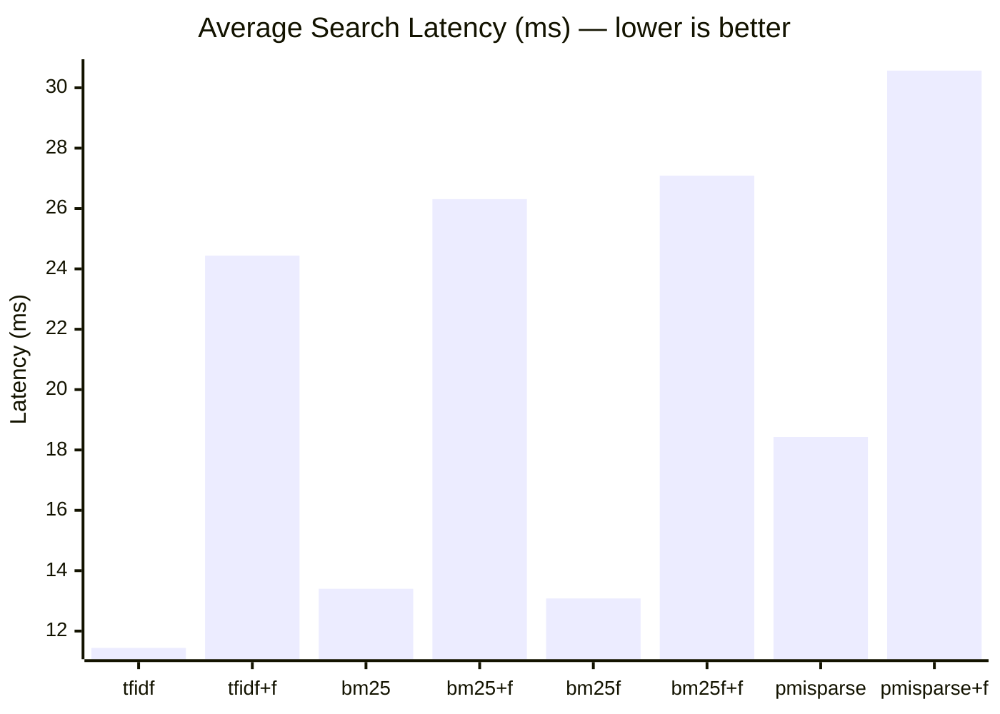
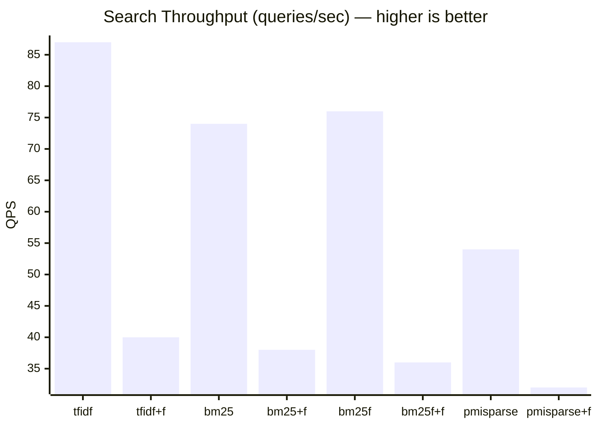
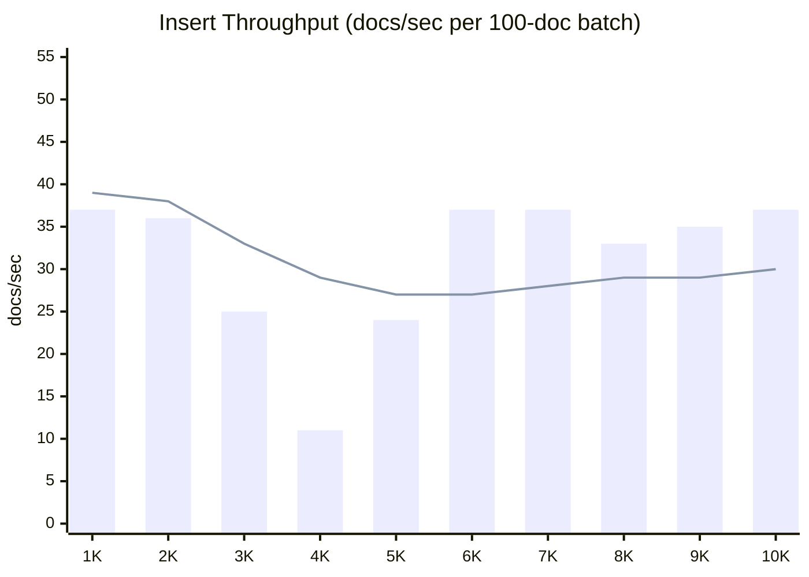

# FTS Algorithm Benchmark

> Auto-generated by `test/search-benchmark.sh` on 2026-03-05 01:13:39

## Environment

| Parameter | Value |
|-----------|-------|
| OS | Darwin 25.3.0 arm64 |
| Go | go1.26.0 |
| Documents | 10000 |
| Queries | 10 diverse queries |
| Iterations | 10 per query per algorithm |
| Runs | 10 (benchmark repeated 10x, results aggregated) |
| Total searches | 1000 per algorithm config |
| Warmup | 5 queries per run (discarded) |

## Algorithms

| Algorithm | Description |
|-----------|-------------|
| **tfidf** | Classic TF-IDF term frequency scoring |
| **bm25** | Okapi BM25 probabilistic ranking with length normalization |
| **bm25f** | BM25F field-weighted scoring (title, meta, content) |
| **pmisparse** | BM25 + PMI query expansion (invented by Tradik Limited) |
| **+fuzzy** | Levenshtein distance 1 fuzzy matching variant |

## Latency Results

| Algorithm | Avg (ms) | P50 (ms) | P95 (ms) | P99 (ms) | Min (ms) | Max (ms) | QPS |
|-----------|----------|----------|----------|----------|----------|----------|-----|
| tfidf | 11.44 | 11.09 | 12.98 | 17.60 | 9.84 | 29.02 | 87 |
| tfidf+fuzzy | 24.44 | 23.71 | 27.34 | 35.54 | 22.39 | 102.60 | 40 |
| bm25 | 13.40 | 12.07 | 16.13 | 35.68 | 10.04 | 224.20 | 74 |
| bm25+fuzzy | 26.31 | 24.87 | 30.44 | 40.56 | 23.03 | 254.57 | 38 |
| bm25f | 13.08 | 12.59 | 16.24 | 18.88 | 10.71 | 26.76 | 76 |
| bm25f+fuzzy | 27.09 | 25.94 | 29.72 | 37.40 | 24.31 | 230.38 | 36 |
| pmisparse | 18.43 | 16.74 | 29.92 | 34.30 | 13.19 | 76.31 | 54 |
| pmisparse+fuzzy | 30.57 | 28.87 | 41.22 | 43.98 | 25.84 | 59.31 | 32 |

## Average Latency Comparison


```mermaid
xychart-beta
    title "Average Search Latency (ms) — lower is better"
    x-axis ["tfidf", "tfidf+f", "bm25", "bm25+f", "bm25f", "bm25f+f", "pmisparse", "pmisparse+f"]
    y-axis "Latency (ms)"
    bar [11.44, 24.44, 13.40, 26.31, 13.08, 27.09, 18.43, 30.57]
```

## Throughput Comparison


```mermaid
xychart-beta
    title "Search Throughput (queries/sec) — higher is better"
    x-axis ["tfidf", "tfidf+f", "bm25", "bm25+f", "bm25f", "bm25f+f", "pmisparse", "pmisparse+f"]
    y-axis "QPS"
    bar [87, 40, 74, 38, 76, 36, 54, 32]
```

## Bulk Ingest Throughput

Indexing a document touches three full-text indexes, and each entry point used
to open its own BoltDB write transaction — so a batch paid three commits per
document. Batching a whole chunk into one transaction (GO-027) leaves the work
unchanged and removes the commits.

| | Before | After |
|---|---|---|
| 1000 documents, indexed | 4.20 s (**238 docs/s**) | 0.14 s (**6 996 docs/s**) |
| Allocated | 452 MB | 68 MB |

Measured with `go test -bench BenchmarkBulkIngest -benchmem -run '^$' .` in
`services/mddbd`. The same benchmark with `SkipFTS` reports ~57 000 docs/s,
which is the cost of the document writes alone — indexing was 99.5% of the
time before this change.

The batched index is byte-for-byte identical to the per-document one; a test
compares every FTS bucket entry between the two paths rather than checking
that search still returns something.

## Result Counts per Query

Shows how many documents each algorithm returns (limit=10) to verify they all find relevant results.

| Query | tfidf | bm25 | bm25f | pmisparse |
|-------|-------|------|-------|-----------|
| kubernetes deployment cluster | 10 | 10 | 10 | 10 |
| neural network training | 10 | 10 | 10 | 10 |
| database query optimization | 10 | 10 | 10 | 10 |
| machine learning model | 10 | 10 | 10 | 10 |
| security authentication token | 10 | 10 | 10 | 10 |
| cloud infrastructure scaling | 10 | 10 | 10 | 10 |
| data pipeline processing | 10 | 10 | 10 | 10 |
| api gateway middleware | 10 | 10 | 10 | 10 |
| distributed consensus protocol | 10 | 10 | 10 | 10 |
| search algorithm ranking | 10 | 10 | 10 | 10 |

## Notes

- **tfidf**: Fastest for simple keyword matching. No length normalization.
- **bm25**: Slightly more compute than tfidf due to document length normalization. Best general-purpose algorithm.
- **bm25f**: Adds field-level weighting. Slower due to separate field index lookups.
- **pmisparse**: First search triggers lazy PMI matrix training (not included in benchmark). Subsequent searches include PMI expansion overhead.
- **fuzzy**: Adds Levenshtein distance computation. Expected ~2-3x slower than exact matching.
- All benchmarks run on a warm server with FTS indices already built during document insertion.

## Retrieval quality on the MDDB docs (v2.18.8)

The latency tables above say how fast each algorithm is. This section says how
often it finds the right page. The set is
[`tools/bench/evalsets/docs.json`](https://github.com/tradik/mddb/blob/main/tools/bench/evalsets/docs.json): 20
questions about MDDB, each with the documentation page that answers it, graded
0–3. The questions are phrased the way a user asks, not copied from headings.
The collection is the 60 pages of `docs/`, keyed by file name.

Measured 2026-10-29 on a default-configured server built from this release.
Embeddings came from `nomic-embed-text` through Ollama, autodetected.

```bash
mddb-cli eval docs --queries tools/bench/evalsets/docs.json \
  --config fts/bm25 --config fts/bm25f --config fts/tfidf --config fts/pmisparse \
  --config vector --config hybrid
```

| Configuration | recall@10 | nDCG@10 | MRR | p50 ms | p99 ms |
|---------------|-----------|---------|-----|--------|--------|
| fts/bm25 | 0.825 | 0.739 | 0.723 | 0.9 | 1.9 |
| fts/bm25f | 0.825 | 0.739 | 0.723 | 0.8 | 1.2 |
| fts/tfidf | 0.800 | 0.496 | 0.405 | 1.0 | 1.1 |
| fts/pmisparse | 0.800 | 0.574 | 0.535 | 0.9 | 33.6 |
| vector | 0.875 | 0.763 | 0.750 | 20.1 | 44.2 |
| hybrid (alpha 0.5) | 0.875 | 0.783 | 0.765 | 10.7 | 17.3 |

- **Hybrid ranks best.** It finds as many pages as vector search and puts the
  answer higher: its MRR is 0.765, against 0.723 for BM25.
- **TF-IDF finds the pages but ranks them badly.** Its recall is close to
  BM25, but its MRR is about half.
- **BM25F equals BM25 here.** These documents have no separate title field to
  weight.
- **Some questions share no words with their answer.** "import a million
  documents in the background" should find the bulk-import page. Keyword
  search misses it and vector search finds it. Those questions are where
  vector search earns its latency.
- **Two questions defeat every configuration.** These are "call my endpoint
  when a document changes" (automations) and "which documents are read most
  often" (temporal tracking). The pages never use the asker's words. That
  points at the pages, not at the search.
- **Returned tokens are large because every result is a whole page.** With
  `format: passages` an agent receives a fraction of that.

The same set runs in CI with keyword search only. The test is
`TestEval_DocsSetHoldsTheLine` in `services/mddbd/eval_docs_test.go`. It fails
when recall@10 drops under 0.7 or nDCG@10 under 0.65. The test server there
scores 0.750 and 0.683, because it does not use a default server's
configuration.

## BM25 parameters on the MDDB docs (v2.18.8)

Same corpus and the same 20 questions as above, keyword search only. Only
the BM25 parameters change. Measured 2026-10-29 with:

```bash
mddb-cli eval docs --queries tools/bench/evalsets/docs.json \
  --config fts/bm25 --config fts/bm25:k1=1.2:b=0.3 --config fts/bm25:k1=0.6:b=0.75 \
  --config fts/bm25:k1=2:b=0.75 --config fts/bm25:b=0
```

| k1 | b | recall@10 | nDCG@10 | MRR |
|----|---|-----------|---------|-----|
| 1.2 | 0.75 (default) | 0.825 | 0.739 | 0.723 |
| 1.2 | 0.3 | 0.825 | 0.685 | 0.660 |
| 0.6 | 0.75 | 0.825 | 0.676 | 0.644 |
| 2.0 | 0.75 | 0.825 | 0.749 | 0.731 |
| 1.2 | 0 | 0.800 | 0.523 | 0.438 |

- **Recall barely moves.** The parameters change the order, not what is found.
- **Length normalisation matters here.** These pages run from 39 to almost 20,000
  words, and with `b = 0` the long pages win on repetition alone.
- **The textbook advice points the wrong way.** It suggests a lower `b` for
  short questions, but here it made ranking worse. The one gain came from a
  higher `k1`, a small one.
- **Why the advisor works only from measurement.** It tries `b = 0.3`,
  `k1 = 0.6` and `k1 = 2` on a collection's own evaluation set. It
  recommends a variant only when that variant scores better. There are no
  thresholds on document length behind it.

## Finding code: grep and read vs MDDB passages (v2.18.8)

An agent asked to change something first has to find it. This compares the
two ways it can, on the MDDB repository itself. The comparison counts tokens
and tool calls. It does not measure answer quality.

The 15 tasks are in
[`tools/bench/evalsets/agent-tasks.json`](https://github.com/tradik/mddb/blob/main/tools/bench/evalsets/agent-tasks.json).
Each has a question, the term an agent would grep for first, and the file
that holds the code.

- **grep + read (best)** greps the tracked files, which is what ripgrep
  searches. Output is capped at 250 lines, as agent grep tools cap it. Then
  it reads only the answer file. This is a lower bound, because it assumes
  the agent picks the right file first.
- **grep + read (typical)** greps the same way, then reads the matching
  files with the most matches first until it reaches the answer.
- **mddb** makes one search that returns passages (`format: passages`,
  5 results). The answer counts as found when a passage comes from the
  answer file.

Measured 2026-10-29 on this release. The collection was made with
`mddb-cli autoindex .` from the repository root: 1491 files, 14.5 MB.
Embeddings came from `nomic-embed-text` through Ollama. Tokens are bytes
divided by 4.

```bash
cd tools/bench
go run ./agent -url http://localhost:11023 -collection mddb -root ../.. \
  -tasks evalsets/agent-tasks.json -search vector
```

| Route | Tokens, 15 tasks | Tool calls | Answer reached |
|---|---|---|---|
| grep + read (best) | 139,959 | 28 | 13/15 |
| grep + read (typical) | 2,769,973 | 133 | 13/15 |
| mddb vector, passages | 84,977 | 15 | 13/15 |
| mddb hybrid, passages | 41,666 | 15 | 10/15 |
| mddb fts, passages | 56,284 | 15 | 6/15 |

- **Vector passages match grep on answers found.** They use 0.6× the tokens
  of grep's best case and about 3% of its typical case. They take one call
  per task. Grep takes two in its best case and up to 33 in its typical
  case.
- **Grep's typical case is expensive because common terms match widely.**
  "revision" matches about 160 tracked files, so reading the most-matched
  files first takes 21 reads before the answer.
- **Full-text passages miss most of these questions.** The questions are
  phrased as a person asks them, and the code does not use the same words.
  One question starts with `--fail-below`, which the full-text parser reads
  as an exclusion, so it returns nothing.
- **Hybrid sits between the two here.** On this set it is pulled down by the
  full-text half. Run `mddb-cli eval` on your own questions before picking
  one, as shown in
  [Measuring Instead of Guessing](SEARCH.md#measuring-instead-of-guessing-v2188).
- **Two tasks defeat grep.** For "include paths" and "cross-collection text
  search", the first term an agent would try is not in the answer file.

The tool prints per-task rows as well, and `-json` writes them for further
processing.

## Relevance feedback (v2.18.9)

How much one round of `positive` and `negative` examples recovers on a vector
search (SRCH-015). The corpus is synthetic and built for the case feedback is
for. It has 2,000 documents in 20 topics, at 64 dimensions. Each query means
one topic but is typed half way towards another, so a plain search returns a
mix. The answers are the 10 documents nearest what the query meant. Each
query is searched once and its top 10 is judged against those answers. The
right results go back as `positive` and the wrong ones as `negative`, and the
search runs again in each mode.

Measured 2026-10-29 on an AMD Ryzen 9 7950X (WSL2), against a server built
from this release, flat index, `topK` 10, default oversample:

```bash
MDDB_EMBEDDING_PROVIDER=openai MDDB_EMBEDDING_API_KEY=bench \
MDDB_EMBEDDING_API_URL=http://127.0.0.1:11099/v1 MDDB_EMBEDDING_DIMENSIONS=64 mddbd &
cd tools/bench && go run ./feedback -url http://localhost:11023 -queries 200 -seed 1
```

| Feedback | recall@10 seed 1 | seed 2 | seed 3 | p50 ms | p99 ms |
|----------|------------------|--------|--------|--------|--------|
| none | 0.305 | 0.298 | 0.325 | 0.4 | 1.0 |
| `query` (Rocchio 1 / 0.75 / 0.25) | 0.491 | 0.490 | 0.503 | 0.5 | 1.4 |
| `rescore` (weight 0.5) | 0.478 | 0.469 | 0.480 | 0.5 | 1.0 |

- **One round lifts recall@10 from about 0.31 to about 0.49.** That is 60%
  more of the right documents, and the agent rewrote nothing.
- **`query` is slightly better than `rescore` here, and costs the same.**
  `rescore` can only reorder the 30 candidates the index returned, while
  `query` searches again from a better starting point. `rescore` is for when
  the query vector must stay as it is.
- **Latency barely moves.** Resolving the example keys and one vector
  operation add about 0.1 ms at the median.
- **This corpus favours feedback.** The bench serves its own
  OpenAI-compatible embeddings, so the numbers are reproducible but not
  representative of a real embedding model. Read them as what the mechanism
  can recover, not as what every collection will gain.

## Late interaction over chunks: the SRCH-004 spike (v2.18.9)

MDDB stores a document as one vector per chunk (keys `docID#N`) and scores
it by its best chunk against one vector of the whole query. Late interaction
(ColBERT's MaxSim) scores many query vectors against many document vectors.
The cheap variant tested here needs no new storage. It splits the query into
parts and embeds each part. A document's score is the mean, over the parts,
of each part's best chunk. Mean and sum give the same order, because every
document is scored against the same number of parts.

Two ways of splitting were tried:

- **clauses**: split at punctuation and at "and". A part of one word joins
  the part before it, and a query with nothing to split stays whole.
- **4-word windows**: overlapping windows of 4 words, one every 2 words.

Each split was also tried with the whole query added as one more part.
**best part** is a control, not MaxSim. It scores a document by its best part
instead of the mean, which makes it multi-query fusion. It shows whether a
change comes from splitting the query or from summing over the parts.

The server was not changed. The tool, [`tools/bench/maxsim`](https://github.com/tradik/mddb/tree/main/tools/bench/maxsim),
reads each chunk's similarity to a query part through the existing API. It
calls vector search with `retrievalMode: "chunk"`, the flat index and a
`topK` above the chunk count, and does the aggregation itself. The vector
and hybrid rows come from `POST /v1/eval` with per-query details. Every row
is scored by the same function, which uses the formulas from
`services/mddbd/eval.go`.

There are two query sets:

- **plain**: the 20 questions of `docs.json`.
- **multi-topic**: every pair of those questions joined with "and", 190
  queries. Both answer pages count as relevant. One query vector has to sit
  between two topics here, which is the case MaxSim is supposed to help.

Δ is the difference from **max, whole query**, which is today's scoring
computed on the same client path, so the difference is the aggregation alone.
The interval is a paired bootstrap, 2,000 resamples of the queries. A second
seed moved no bound by more than 0.006. "better / worse" counts the queries
whose nDCG@10 rose or fell.

Measured 2026-10-29 on an AMD Ryzen 9 7950X (WSL2, Go 1.27.3, Ollama 0.33.3).
The server was built from this release, using `nomic-embed-text` through
Ollama, the default chunk size of 1,500 characters (891 chunks over the 60
pages), and the embedding cache off so that every part costs one embedding
call:

```bash
MDDB_EMBEDDING_PROVIDER=ollama MDDB_EMBEDDING_CACHE_SIZE=0 mddbd &
cd tools/bench && go run ./maxsim -url http://localhost:11023 -load -docs ../../docs
```

**Plain set, 20 queries**

| Scoring | recall@10 | nDCG@10 | MRR | Δ nDCG [95% CI] | better / worse | embed calls | p50 ms | p99 ms |
|---|---|---|---|---|---|---|---|---|
| vector (server) | 0.875 | 0.741 | 0.722 | +0.000 [+0.000, +0.000] | 0 / 0 | 1.0 | 11.8 | 52.8 |
| hybrid (server) | 0.875 | 0.814 | 0.806 | +0.073 [−0.026, +0.177] | 6 / 2 | 1.0 | 12.2 | 20.0 |
| max, whole query | 0.875 | 0.741 | 0.722 | — | — | 1.0 | 146.2 | 157.6 |
| maxsim, clauses | 0.875 | 0.750 | 0.722 | +0.008 [−0.003, +0.028] | 1 / 1 | 1.3 | 147.5 | 430.3 |
| maxsim, 4-word windows | 0.925 | 0.723 | 0.690 | −0.018 [−0.121, +0.079] | 4 / 5 | 3.0 | 483.1 | 813.4 |
| maxsim, whole + clauses | 0.875 | 0.744 | 0.722 | +0.002 [−0.003, +0.010] | 1 / 1 | 1.5 | 147.5 | 587.5 |
| maxsim, whole + windows | 0.925 | 0.739 | 0.704 | −0.003 [−0.076, +0.069] | 3 / 5 | 4.1 | 627.4 | 959.5 |
| best part, clauses (control) | 0.850 | 0.711 | 0.689 | −0.030 [−0.079, +0.000] | 0 / 2 | 1.3 | 147.5 | 430.3 |

**Multi-topic set, 190 queries**

| Scoring | recall@10 | nDCG@10 | MRR | Δ nDCG [95% CI] | Δ recall [95% CI] | better / worse | embed calls | p50 ms | p99 ms |
|---|---|---|---|---|---|---|---|---|---|
| vector (server) | 0.736 | 0.602 | 0.760 | −0.002 [−0.005, +0.000] | −0.005 [−0.013, +0.000] | 0 / 2 | 1.0 | 12.9 | 28.3 |
| hybrid (server) | 0.754 | 0.609 | 0.732 | +0.006 [−0.025, +0.037] | +0.014 [−0.015, +0.043] | 80 / 73 | 1.0 | 12.7 | 22.0 |
| max, whole query | 0.741 | 0.603 | 0.760 | — | — | — | 1.0 | 153.3 | 260.2 |
| maxsim, clauses | 0.663 | 0.481 | 0.575 | −0.123 [−0.147, −0.098] | −0.078 [−0.112, −0.044] | 32 / 128 | 2.5 | 299.6 | 724.4 |
| maxsim, 4-word windows | 0.685 | 0.440 | 0.464 | −0.164 [−0.191, −0.135] | −0.056 [−0.090, −0.019] | 30 / 141 | 7.5 | 1173.6 | 1629.0 |
| maxsim, whole + clauses | 0.708 | 0.528 | 0.635 | −0.076 [−0.098, −0.055] | −0.032 [−0.065, −0.000] | 37 / 108 | 3.5 | 461.0 | 878.5 |
| maxsim, whole + windows | 0.696 | 0.475 | 0.534 | −0.128 [−0.154, −0.102] | −0.045 [−0.078, −0.013] | 31 / 130 | 8.5 | 1330.3 | 1781.8 |
| best part, clauses (control) | 0.783 | 0.655 | 0.765 | +0.051 [+0.023, +0.080] | +0.042 [+0.005, +0.079] | 101 / 58 | 2.5 | 299.6 | 724.4 |

The server rows give the server's own latency from `/v1/eval`. The other rows
give client round trips, one after another, one per part. Each round trip
returns all 891 chunks as JSON, about 150 ms, so those rows show only how
latency grows with the number of parts. They are not what a server-side
implementation would cost. That cost would be one embedding call per part,
about 10 ms each with this model, plus one flat pass over the chunks per
part. On the plain set the client path returns the same top 10 as the
server's vector search on 19 of 20 queries, and on 175 of 190 multi-topic
queries. The difference comes from the server's parent mode: it collapses an
oversampled chunk list into documents and can then return fewer than 10.

- **MaxSim makes multi-topic queries worse, well beyond the noise.** Every
  split loses 0.08 to 0.16 nDCG@10, and every interval lies entirely below
  zero. The mean over the parts rewards a page that is moderately close to
  both topics over the two pages that each answer one of them. ColBERT's
  MaxSim assumes that one document answers the whole query. In a query that
  joins two needs, that assumption is false.
- **On plain questions it changes nothing measurable.** Clause splitting
  rarely finds anything to split (1.3 parts per query). Windows find one
  more page in recall but rank worse, and every interval spans zero.
- **The gain on multi-topic queries comes from splitting, not from summing.**
  The best-part control gains +0.051 nDCG@10 [+0.023, +0.080] and +0.042
  recall. It loses 0.030 on plain questions, with an interval that touches
  zero. That is multi-query fusion, which is query decomposition and not late
  interaction. If it is pursued, it needs its own ticket and its own
  measurements.
- **Hybrid stays the strongest single-call option on plain questions**
  (+0.073 nDCG@10, though 20 queries cannot separate it from noise).

**Verdict: no-go** for MaxSim over the existing chunks. The full variant,
with token-level vectors, is **deferred**. None of the supported embedding
providers returns token vectors today:

- OpenAI `/v1/embeddings` returns one vector per input
  ([API reference](https://developers.openai.com/api/reference/resources/embeddings/methods/create)).
- Ollama `/api/embed` returns one vector per input and has no per-token
  option ([API](https://docs.ollama.com/api/embed)).
- Voyage returns one vector per input. Its contextualized chunk embeddings
  (`voyage-context-4`) are also one vector per chunk
  ([embeddings](https://docs.voyageai.com/docs/embeddings),
  [contextualized](https://docs.voyageai.com/docs/contextualized-chunk-embeddings)).
- Cohere `embed` returns one vector per input
  ([API reference](https://docs.cohere.com/reference/embed)).

Storing token vectors for this corpus would take about 279,000 tokens. That
assumes 4 bytes per token and a 128-dimension ColBERT-style model. Today the
corpus takes 891 × 768 × 4 B = 2.7 MB. The token vectors would take:

| Format | Bytes per token | Corpus | vs today |
|---|---|---|---|
| float32 | 512 | 143 MB | 52× |
| SQ (int8) | ~141 | 39 MB | 14× |
| SQ4 (int4) | ~77 | 21 MB | 7.8× |
| BQ (1 bit) | 16 | 4.5 MB | 1.6× |

The SQ and SQ4 overheads come from the per-vector calibration listed in
[QUANTIZATION.md](QUANTIZATION.md). The BQ figure assumes no per-vector
overhead, which has not been measured.

---

# Insert Throughput Benchmark

Benchmark tool for measuring MDDB document insertion throughput. Inserts documents in configurable batches, records timing per batch, and generates an HTML report with an SVG chart.

## Prerequisites

- MDDB server running (default `http://localhost:7890`)
- Go 1.27+

## Build

```bash
cd tools/bench
go build -o mddb-bench .
```

## Usage

```bash
# Start MDDB
cd services/mddbd
go run . -db /tmp/bench.db

# Run benchmark (default: 10K docs, batches of 100)
cd tools/bench
./mddb-bench

# Custom parameters
./mddb-bench -total 5000 -batch 50 -collection mybench -output results.html

# Cleanup collection after benchmark
./mddb-bench -total 1000 -cleanup
```

## Flags

| Flag           | Default                    | Description                        |
|----------------|----------------------------|------------------------------------|
| `-url`         | `http://localhost:7890`    | MDDB server URL                    |
| `-collection`  | `bench`                    | Collection to insert into          |
| `-total`       | `10000`                    | Total documents to insert          |
| `-batch`       | `100`                      | Batch size for timing measurements |
| `-output`      | `bench_report.html`        | HTML report output path            |
| `-cleanup`     | `false`                    | Delete collection after benchmark  |

## What It Measures

Each document is a simulated blog post with:
- Random title (3-6 words)
- Random tags (1-3 from a pool of 20)
- Random author
- 2-5 paragraphs of lorem ipsum (~500-2000 characters)

Documents are inserted one-by-one via `POST /v1/add`. Every batch of N documents is timed and throughput is calculated.

## Results (2026-03-06)

> Environment: Darwin 25.3.0 arm64, Go 1.26.0, sequential `POST /v1/add` (one doc at a time)

### Summary

| Metric            | Value        |
|-------------------|--------------|
| Total documents   | 10,000       |
| Total time        | 5m 34s       |
| Avg throughput    | 30 docs/sec  |
| Min batch         | 11 docs/sec  |
| Max batch         | 49 docs/sec  |
| Batch size        | 100          |

### Throughput per Batch

| Docs    | docs/sec | Cum. avg | Notes                              |
|---------|----------|----------|------------------------------------|
| 100     | 49       | 49       | Cold start, fastest batch          |
| 500     | 38       | 41       |                                    |
| 1,000   | 37       | 39       | Stable ~37-39 range                |
| 2,000   | 36       | 38       |                                    |
| 2,500   | 22       | 35       | Degradation begins (FTS index growth) |
| 3,000   | 25       | 33       |                                    |
| 4,000   | 11       | 29       | Worst batch — likely BoltDB compaction |
| 5,000   | 24       | 27       |                                    |
| 6,000   | 37       | 27       | Recovery after compaction           |
| 7,000   | 37       | 28       | Stabilized ~35-38                   |
| 8,000   | 33       | 29       |                                    |
| 9,000   | 35       | 29       |                                    |
| 10,000  | 37       | 30       | Final average: 30 docs/sec         |

### Throughput Chart


```mermaid
xychart-beta
    title "Insert Throughput (docs/sec per 100-doc batch)"
    x-axis ["1K", "2K", "3K", "4K", "5K", "6K", "7K", "8K", "9K", "10K"]
    y-axis "docs/sec" 0 --> 55
    bar [37, 36, 25, 11, 24, 37, 37, 33, 35, 37]
    line [39, 38, 33, 29, 27, 27, 28, 29, 29, 30]
```

### Observations

- **0-2K docs**: Stable ~37-49 docs/sec. BoltDB is small, FTS index fits comfortably.
- **2K-5K docs**: Throughput drops to 11-25 docs/sec. FTS token index grows, BoltDB page splits and fsync become expensive.
- **5K-10K docs**: Recovery to ~33-38 docs/sec. BoltDB has compacted and stabilized at a larger page count.
- **Batch 40 dip (4000 docs)**: 9.3s for 100 docs (11 docs/sec) — classic BoltDB B+ tree rebalancing spike.
- Each insert includes: JSON decode, BoltDB write, FTS tokenization + index update, revision tracking, checksum computation.

## How to Run

```bash
cd tools/bench
go build -o mddb-bench .
./mddb-bench -url http://localhost:7890 -total 10000 -batch 100 -output bench_report.html -cleanup
```

## Flags

| Flag           | Default                    | Description                        |
|----------------|----------------------------|------------------------------------|
| `-url`         | `http://localhost:7890`    | MDDB server URL                    |
| `-collection`  | `bench`                    | Collection to insert into          |
| `-total`       | `10000`                    | Total documents to insert          |
| `-batch`       | `100`                      | Batch size for timing measurements |
| `-output`      | `bench_report.html`        | HTML report output path            |
| `-cleanup`     | `false`                    | Delete collection after benchmark  |

## HTML Report

The tool also generates a self-contained HTML report with an interactive SVG bar chart, cumulative average trend line, and detailed per-batch table. Open in any browser — no external dependencies.
