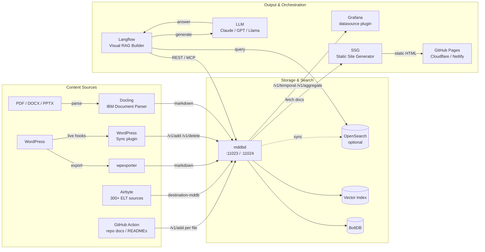
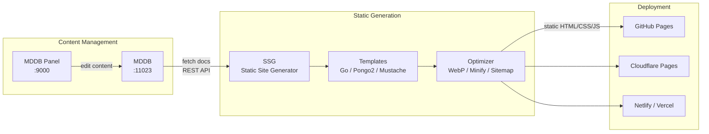
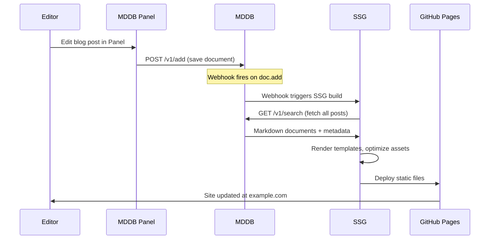
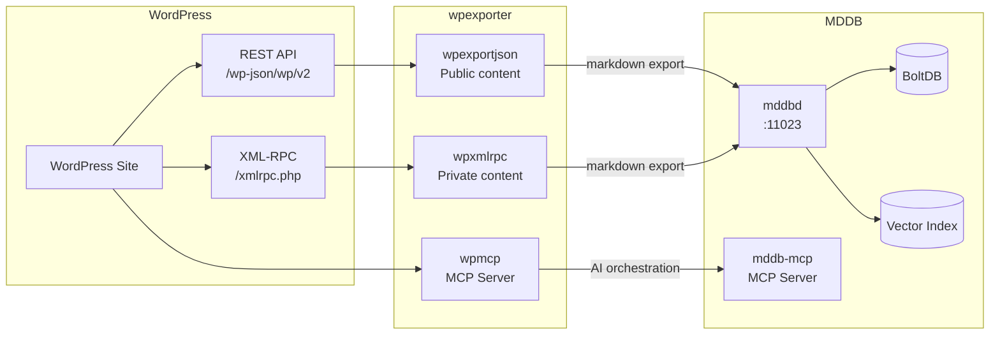
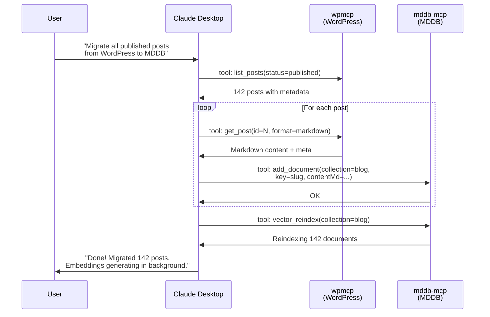
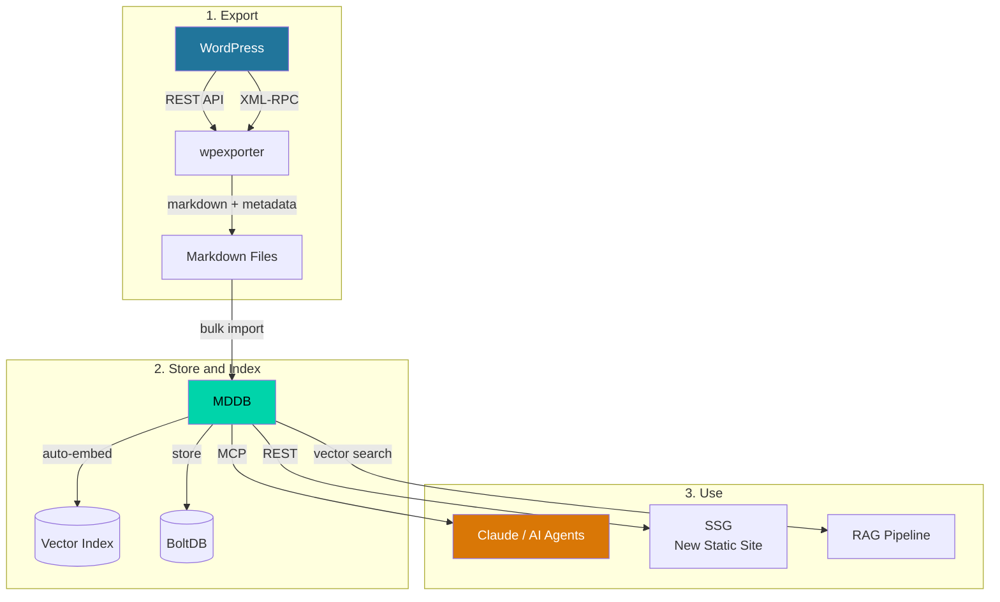
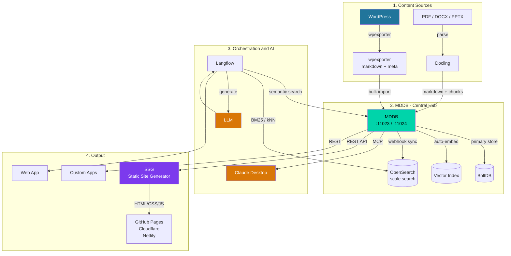

# Integrations: Docling, Langflow, OpenSearch, Airbyte, GitHub Action & Grafana

Use MDDB alongside popular AI/ML, ELT, and observability tools to build production document processing and RAG pipelines.

## Architecture Overview



---

## 1. Docling → MDDB (Document Ingestion)

[Docling](https://github.com/DS4SD/docling) is IBM's document parser that converts PDF, DOCX, PPTX, and HTML into structured Markdown. Since MDDB stores Markdown natively, this is a natural fit.

### Install Docling

```bash
pip install docling
```

### Basic: Parse and Store a Single Document

```python
from docling.document_converter import DocumentConverter
import requests

MDDB_URL = "http://localhost:11023"

# Step 1: Parse PDF to Markdown with Docling
converter = DocumentConverter()
result = converter.convert("report.pdf")
markdown = result.document.export_to_markdown()

# Step 2: Store in MDDB
requests.post(f"{MDDB_URL}/v1/add", json={
    "collection": "reports",
    "key": "report-2026-q1",
    "lang": "en_US",
    "meta": {
        "source": ["docling"],
        "type": ["pdf"],
        "title": ["Q1 2026 Report"],
    },
    "contentMd": markdown,
})
```

### Batch: Ingest a Folder of Documents

```python
"""
Bulk-import a folder of documents via Docling → MDDB.
Supports PDF, DOCX, PPTX, HTML.
"""
from docling.document_converter import DocumentConverter
from pathlib import Path
import requests

MDDB_URL = "http://localhost:11023"
COLLECTION = "knowledge-base"
INPUT_DIR = Path("./documents")

converter = DocumentConverter()
supported = {".pdf", ".docx", ".pptx", ".html", ".htm"}

for file in INPUT_DIR.iterdir():
    if file.suffix.lower() not in supported:
        continue

    print(f"Processing: {file.name}")
    result = converter.convert(str(file))
    markdown = result.document.export_to_markdown()

    resp = requests.post(f"{MDDB_URL}/v1/add", json={
        "collection": COLLECTION,
        "key": file.stem,
        "lang": "en_US",
        "meta": {
            "source": ["docling"],
            "type": [file.suffix.lstrip(".")],
            "filename": [file.name],
        },
        "contentMd": markdown,
    })

    if resp.status_code == 200:
        print(f"  OK: {file.name}")
    else:
        print(f"  ERROR: {resp.text}")

# Embeddings are generated automatically in the background
print("Done. Check embedding progress:")
print(requests.get(f"{MDDB_URL}/v1/vector-stats").json())
```

### With Chunking (for Better Vector Search)

Long documents should be split into chunks for more precise semantic search:

```python
from docling.document_converter import DocumentConverter
from docling.chunking import HybridChunker
import requests

MDDB_URL = "http://localhost:11023"

converter = DocumentConverter()
result = converter.convert("manual.pdf")

# Docling's built-in chunker splits by sections/paragraphs
chunker = HybridChunker(tokenizer="sentence-transformers/all-MiniLM-L6-v2")
chunks = list(chunker.chunk(result.document))

for i, chunk in enumerate(chunks):
    text = chunk.text
    # Skip very short chunks
    if len(text.strip()) < 50:
        continue

    requests.post(f"{MDDB_URL}/v1/add", json={
        "collection": "manual",
        "key": f"manual-chunk-{i:04d}",
        "lang": "en_US",
        "meta": {
            "source": ["docling"],
            "chunk_index": [str(i)],
            "parent_doc": ["manual.pdf"],
        },
        "contentMd": text,
    })

print(f"Imported {len(chunks)} chunks from manual.pdf")
```

### Docker Pipeline

```bash
# docker-compose.yml
services:
  mddb:
    image: tradik/mddb:latest
    ports:
      - "11023:11023"
      - "11024:11024"
      - "9000:9000"
    volumes:
      - mddb-data:/app/data
    environment:
      MDDB_EMBEDDING_PROVIDER: openai
      MDDB_EMBEDDING_API_KEY: ${OPENAI_API_KEY}

  docling-ingest:
    build:
      context: .
      dockerfile: Dockerfile.docling
    volumes:
      - ./documents:/documents
    environment:
      MDDB_URL: http://mddb:11023
    depends_on:
      - mddb

volumes:
  mddb-data:
```

```dockerfile
# Dockerfile.docling
FROM python:3.11-slim
RUN pip install docling requests
COPY ingest.py /app/ingest.py
CMD ["python", "/app/ingest.py"]
```

---

## 2. Langflow + MDDB (Visual RAG Orchestration)

[Langflow](https://github.com/langflow-ai/langflow) is a visual framework for building LLM workflows. MDDB can be integrated as a retrieval component via REST API or MCP.

### Install Langflow

```bash
pip install langflow
langflow run
# Opens at http://localhost:7860
```

### Option A: Custom Python Component (REST API)

Create a custom Langflow component that queries MDDB:

```python
"""
MDDB Search Component for Langflow.
Save as: mddb_component.py
Import in Langflow via Custom Components.
"""
from langflow.custom import Component
from langflow.io import MessageTextInput, IntInput, Output
from langflow.schema import Data
import requests


class MDDBSearch(Component):
    display_name = "MDDB Semantic Search"
    description = "Search MDDB knowledge base using semantic/vector search."
    icon = "search"

    inputs = [
        MessageTextInput(
            name="query",
            display_name="Search Query",
            info="Natural language query to search for.",
        ),
        MessageTextInput(
            name="mddb_url",
            display_name="MDDB URL",
            value="http://localhost:11023",
            info="MDDB server address.",
        ),
        MessageTextInput(
            name="collection",
            display_name="Collection",
            value="docs",
            info="MDDB collection to search.",
        ),
        IntInput(
            name="top_k",
            display_name="Top K",
            value=5,
            info="Number of results to return.",
        ),
    ]

    outputs = [
        Output(display_name="Results", name="results", method="search"),
    ]

    def search(self) -> list[Data]:
        response = requests.post(
            f"{self.mddb_url}/v1/vector-search",
            json={
                "collection": self.collection,
                "query": self.query,
                "topK": self.top_k,
                "threshold": 0.6,
                "includeContent": True,
            },
        )
        results = response.json().get("results", [])

        return [
            Data(data={
                "key": r["document"]["key"],
                "content": r["document"].get("contentMd", ""),
                "score": r["score"],
                "meta": r["document"].get("meta", {}),
            })
            for r in results
        ]
```

#### Using in Langflow

1. Open Langflow UI → **My Collection** → **New Project**
2. Go to **Custom Components** → upload `mddb_component.py`
3. Build a flow:

```
[Chat Input] → [MDDB Semantic Search] → [Parse Data] → [Prompt] → [LLM] → [Chat Output]
```

The Prompt template:

```
Answer the user's question based on the following documents from the knowledge base.
Cite sources by their key.

Context:
{documents}

Question: {query}
```

### Option B: Langflow + MDDB via MCP

If your Langflow version supports MCP tool calling, connect MDDB directly:

```json
{
  "mcpServers": {
    "mddb": {
      "command": "docker",
      "args": [
        "run", "-i", "--rm", "--network", "host",
        "-v", "mddb-data:/app/data",
        "-e", "MDDB_MCP_STDIO=true",
        "tradik/mddb:latest"
      ]
    }
  }
}
```

Available MCP tools for Langflow: `semantic_search`, `full_text_search`, `hybrid_search`, `search_documents`, `add_document`, `import_url`, and [48 more](LLM_CONNECTIONS.md).

### Option C: Langflow API Tool (No Custom Code)

Use Langflow's built-in **API Request** component to call MDDB directly:

1. Add an **API Request** component
2. Set **Method**: POST
3. Set **URL**: `http://localhost:11023/v1/vector-search`
4. Set **Body**:
```json
{
  "collection": "docs",
  "query": "{query}",
  "topK": 5,
  "includeContent": true
}
```
5. Connect: `[Chat Input] → [API Request] → [Parse Data] → [Prompt] → [LLM] → [Chat Output]`

### Full Langflow RAG Flow Example


---

## 3. OpenSearch + MDDB (Scalable Search)

MDDB's built-in vector search works well up to ~50K documents. For larger datasets or advanced full-text search (BM25, aggregations, facets), sync documents to [OpenSearch](https://opensearch.org/).

### Architecture

| Feature | MDDB | OpenSearch |
|---------|------|------------|
| Storage | Primary (BoltDB) | Search index (replica) |
| Vector search | In-memory, ~50K docs | kNN plugin, millions |
| Full-text search | Built-in TF scoring | BM25, analyzers, stemming |
| Aggregations | No | Yes (facets, histograms) |
| MCP tools | 52 built-in | No |

**Strategy**: MDDB as the primary store + MCP interface, OpenSearch as the search backend for scale.

### Setup OpenSearch

```bash
# docker-compose.yml
services:
  mddb:
    image: tradik/mddb:latest
    ports:
      - "11023:11023"
    volumes:
      - mddb-data:/app/data
    environment:
      MDDB_EMBEDDING_PROVIDER: openai
      MDDB_EMBEDDING_API_KEY: ${OPENAI_API_KEY}

  opensearch:
    image: opensearchproject/opensearch:2
    ports:
      - "9200:9200"
    environment:
      discovery.type: single-node
      DISABLE_SECURITY_PLUGIN: "true"
    volumes:
      - os-data:/usr/share/opensearch/data

  opensearch-dashboards:
    image: opensearchproject/opensearch-dashboards:2
    ports:
      - "5601:5601"
    environment:
      OPENSEARCH_HOSTS: '["http://opensearch:9200"]'
      DISABLE_SECURITY_DASHBOARDS_PLUGIN: "true"

volumes:
  mddb-data:
  os-data:
```

### Create OpenSearch Index

```bash
curl -X PUT http://localhost:9200/mddb-docs -H 'Content-Type: application/json' -d '{
  "settings": {
    "index": {
      "knn": true,
      "number_of_replicas": 0
    }
  },
  "mappings": {
    "properties": {
      "key":        { "type": "keyword" },
      "collection": { "type": "keyword" },
      "lang":       { "type": "keyword" },
      "contentMd":  { "type": "text", "analyzer": "standard" },
      "meta":       { "type": "object", "enabled": true },
      "addedAt":    { "type": "date" },
      "updatedAt":  { "type": "date" },
      "embedding": {
        "type": "knn_vector",
        "dimension": 1536,
        "method": {
          "name": "hnsw",
          "engine": "lucene"
        }
      }
    }
  }
}'
```

### Sync Script: MDDB → OpenSearch

```python
"""
Sync documents from MDDB to OpenSearch.
Run periodically (cron) or trigger via MDDB webhook.
"""
import requests
import json

MDDB_URL = "http://localhost:11023"
OS_URL = "http://localhost:9200"
INDEX = "mddb-docs"


def sync_collection(collection: str):
    """Export all docs from MDDB and index into OpenSearch."""

    # Step 1: Export from MDDB as NDJSON
    resp = requests.post(f"{MDDB_URL}/v1/export", json={
        "collection": collection,
        "format": "ndjson",
    })

    if resp.status_code != 200:
        print(f"Export failed: {resp.text}")
        return

    # Step 2: Bulk index into OpenSearch
    bulk_body = ""
    count = 0

    for line in resp.text.strip().split("\n"):
        if not line:
            continue
        doc = json.loads(line)
        doc_id = f"{collection}|{doc['key']}|{doc.get('lang', 'en_us')}"

        bulk_body += json.dumps({"index": {"_index": INDEX, "_id": doc_id}}) + "\n"
        bulk_body += json.dumps({
            "key": doc["key"],
            "collection": collection,
            "lang": doc.get("lang", ""),
            "contentMd": doc.get("contentMd", ""),
            "meta": doc.get("meta", {}),
            "addedAt": doc.get("addedAt"),
            "updatedAt": doc.get("updatedAt"),
        }) + "\n"
        count += 1

    if bulk_body:
        r = requests.post(
            f"{OS_URL}/_bulk",
            data=bulk_body,
            headers={"Content-Type": "application/x-ndjson"},
        )
        result = r.json()
        errors = result.get("errors", False)
        print(f"Synced {count} docs from '{collection}' → OpenSearch (errors={errors})")


# Sync all collections
stats = requests.get(f"{MDDB_URL}/v1/stats").json()
for coll in stats.get("collections", {}).keys():
    sync_collection(coll)
```

### Real-Time Sync via MDDB Webhooks

Instead of periodic sync, use MDDB webhooks for real-time updates:

```bash
# Register webhook that fires on document add/update/delete
curl -X POST http://localhost:11023/v1/webhooks -H 'Content-Type: application/json' -d '{
  "url": "http://sync-service:8080/mddb-webhook",
  "events": ["doc.add", "doc.update", "doc.delete"],
  "collections": ["*"]
}'
```

Webhook handler that updates OpenSearch:

```python
"""
Webhook receiver: syncs individual document changes to OpenSearch.
Run as a small Flask/FastAPI service.
"""
from fastapi import FastAPI, Request
import requests

app = FastAPI()
OS_URL = "http://localhost:9200"
INDEX = "mddb-docs"
MDDB_URL = "http://localhost:11023"


@app.post("/mddb-webhook")
async def handle_webhook(request: Request):
    payload = await request.json()
    event = payload.get("event")
    collection = payload.get("collection")
    key = payload.get("key")
    lang = payload.get("lang", "en_us")
    doc_id = f"{collection}|{key}|{lang}"

    if event in ("doc.add", "doc.update"):
        # Fetch full document from MDDB
        resp = requests.post(f"{MDDB_URL}/v1/get", json={
            "collection": collection, "key": key, "lang": lang,
        })
        doc = resp.json()

        # Index into OpenSearch
        requests.put(f"{OS_URL}/{INDEX}/_doc/{doc_id}", json={
            "key": key,
            "collection": collection,
            "lang": lang,
            "contentMd": doc.get("contentMd", ""),
            "meta": doc.get("meta", {}),
        })

    elif event == "doc.delete":
        requests.delete(f"{OS_URL}/{INDEX}/_doc/{doc_id}")

    return {"ok": True}
```

### Query OpenSearch from MDDB Pipeline

```python
"""
Hybrid search: MDDB for semantic, OpenSearch for full-text.
Merge results for best recall.
"""
import requests

MDDB_URL = "http://localhost:11023"
OS_URL = "http://localhost:9200"


def hybrid_search(query: str, collection: str, top_k: int = 5) -> list:
    # Semantic search via MDDB
    mddb_resp = requests.post(f"{MDDB_URL}/v1/vector-search", json={
        "collection": collection,
        "query": query,
        "topK": top_k,
        "threshold": 0.6,
        "includeContent": True,
    })
    vector_results = mddb_resp.json().get("results", [])

    # Full-text search via OpenSearch (BM25)
    os_resp = requests.post(f"{OS_URL}/mddb-docs/_search", json={
        "query": {
            "bool": {
                "must": {"match": {"contentMd": query}},
                "filter": {"term": {"collection": collection}},
            }
        },
        "size": top_k,
    })
    os_hits = os_resp.json().get("hits", {}).get("hits", [])

    # Merge and deduplicate
    seen = set()
    merged = []

    for r in vector_results:
        key = r["document"]["key"]
        if key not in seen:
            seen.add(key)
            merged.append({
                "key": key,
                "content": r["document"].get("contentMd", ""),
                "vector_score": r["score"],
                "source": "mddb-vector",
            })

    for hit in os_hits:
        key = hit["_source"]["key"]
        if key not in seen:
            seen.add(key)
            merged.append({
                "key": key,
                "content": hit["_source"].get("contentMd", ""),
                "bm25_score": hit["_score"],
                "source": "opensearch-bm25",
            })

    return merged[:top_k]
```

### OpenSearch kNN Search (Vector Search at Scale)

For datasets larger than ~50K documents, use OpenSearch kNN instead of MDDB's in-memory index:

```python
"""
Use OpenSearch kNN for large-scale vector search.
Requires syncing embeddings from MDDB to OpenSearch.
"""
import requests
import numpy as np

MDDB_URL = "http://localhost:11023"
OS_URL = "http://localhost:9200"


def get_embedding(text: str) -> list:
    """Get embedding vector from MDDB's embedding endpoint."""
    resp = requests.post(f"{MDDB_URL}/v1/embed", json={"text": text})
    return resp.json().get("embedding", [])


def opensearch_knn_search(query: str, collection: str, k: int = 10):
    """Semantic search via OpenSearch kNN plugin."""
    embedding = get_embedding(query)

    resp = requests.post(f"{OS_URL}/mddb-docs/_search", json={
        "size": k,
        "query": {
            "bool": {
                "must": {
                    "knn": {
                        "embedding": {
                            "vector": embedding,
                            "k": k,
                        }
                    }
                },
                "filter": {"term": {"collection": collection}},
            }
        },
    })

    hits = resp.json().get("hits", {}).get("hits", [])
    return [
        {
            "key": h["_source"]["key"],
            "content": h["_source"].get("contentMd", ""),
            "score": h["_score"],
        }
        for h in hits
    ]
```

---

## 4. SSG — Static Site Generator from MDDB

[SSG](https://github.com/spagu/ssg/) is a high-performance static site generator written in Go with **built-in MDDB support**. It pulls Markdown content directly from MDDB collections and renders complete static websites with themes, minification, and deployment-ready output.



### Generate a Site from MDDB Collection

```bash
# Install SSG
brew install spagu/tap/ssg
# or: go install github.com/spagu/ssg@latest

# Generate site from MDDB collection
ssg --mddb-url=http://localhost:11023 \
    --mddb-collection=blog \
    --mddb-lang=en_US \
    krowy example.com

# Output in ./public/ — ready to deploy
```

### CLI Flags

| Flag | Description | Default |
|------|-------------|---------|
| `--mddb-url` | MDDB server URL (enables MDDB mode) | — |
| `--mddb-collection` | Collection to fetch posts from | — |
| `--mddb-key` | API key for authentication | — |
| `--mddb-lang` | Language filter | `en_US` |
| `--mddb-timeout` | Request timeout in seconds | `30` |

### Dev Server with Live Reload

```bash
# Watch MDDB for changes, auto-rebuild
ssg serve --mddb-url=http://localhost:11023 \
          --mddb-collection=blog \
          krowy example.com
# Opens at http://localhost:8080 with file watching
```

### CI/CD Pipeline: MDDB → SSG → GitHub Pages

```yaml
# .github/workflows/deploy.yml
name: Deploy Site
on:
  workflow_dispatch:
  schedule:
    - cron: '0 */6 * * *'  # every 6 hours

jobs:
  build:
    runs-on: ubuntu-latest
    steps:
      - uses: actions/checkout@v4

      - name: Install SSG
        run: |
          curl -sL https://github.com/spagu/ssg/releases/latest/download/ssg_linux_amd64.tar.gz | tar xz
          sudo mv ssg /usr/local/bin/

      - name: Build site from MDDB
        run: |
          ssg --mddb-url=${{ secrets.MDDB_URL }} \
              --mddb-collection=blog \
              --mddb-key=${{ secrets.MDDB_API_KEY }} \
              krowy ${{ vars.SITE_DOMAIN }}

      - name: Deploy to GitHub Pages
        uses: peaceiris/actions-gh-pages@v3
        with:
          github_token: ${{ secrets.GITHUB_TOKEN }}
          publish_dir: ./public
```

### Docker Pipeline

```bash
# docker-compose.yml
services:
  mddb:
    image: tradik/mddb:latest
    ports:
      - "11023:11023"
      - "9000:9000"
    volumes:
      - mddb-data:/app/data

  ssg:
    image: spagu/ssg:latest
    depends_on:
      - mddb
    command: >
      ssg --mddb-url=http://mddb:11023
          --mddb-collection=blog
          krowy example.com
    volumes:
      - ./public:/app/public

volumes:
  mddb-data:
```

### Structured frontmatter: what MDDB can and cannot hold

SSG pages often carry structured frontmatter — an `faq:` list of objects, a
`schema:` Recipe JSON-LD block. MDDB's metadata is flat
(`map<string, repeated string>`) and cannot hold it directly. An importer that
stringifies nested YAML with Go's `%v` produces values like
`map[answer:Yes question:Is it free?]`; MDDB stores them faithfully, and the
site build fails later on a template that cannot render them
([issue #187](https://github.com/tradik/mddb/issues/187)).

Before ingesting a site with structured frontmatter, pick one of the three
patterns in [API.md](API.md#structured-frontmatter-and-flat-meta) — JSON in a
single value, flattened leaf keys, or leaving the block in the markdown body.
`POST /v1/validate` warns when a value looks stringified, so a pipeline can
catch it at import time rather than at render time:

```bash
curl -s -X POST "$MDDB/v1/validate" \
  -H 'Content-Type: application/json' \
  -d '{"collection":"site","meta":{"faq":["[map[answer:Yes question:Is it free?]]"]}}' \
  | jq .warnings
```

### Workflow: Edit in Panel → Generate → Deploy



---

## 5. wpexporter — WordPress to MDDB Migration

[wpexporter](https://github.com/tradik/wpexporter/) is a Go toolkit for exporting WordPress content. It supports 14+ output formats including Markdown, and includes an MCP server (`wpmcp`) for AI-assisted migrations.



### Quick Export: WordPress → Markdown → MDDB

```bash
# Step 1: Export WordPress to Markdown
wpexportjson -url https://your-site.com -format markdown -output ./wp-export/

# Step 2: Bulk import into MDDB
for file in wp-export/*.md; do
  key=$(basename "$file" .md)
  content=$(cat "$file")

  curl -X POST http://localhost:11023/v1/add \
    -H 'Content-Type: application/json' \
    -d "{
      \"collection\": \"blog\",
      \"key\": \"$key\",
      \"lang\": \"en_US\",
      \"meta\": {\"source\": [\"wordpress\"]},
      \"contentMd\": $(echo "$content" | jq -Rs .)
    }"
done
```

### Python: Full Migration with Metadata

```python
"""
Migrate WordPress → MDDB with full metadata preservation.
Uses wpexportjson JSON output for richer metadata.
"""
import subprocess
import json
import requests
from pathlib import Path

MDDB_URL = "http://localhost:11023"
WP_URL = "https://your-site.com"
COLLECTION = "blog"

# Step 1: Export WordPress as JSON (includes metadata)
subprocess.run([
    "wpexportjson",
    "-url", WP_URL,
    "-format", "json",
    "-output", "./wp-export.json",
])

# Step 2: Load and import into MDDB
with open("wp-export.json") as f:
    posts = json.load(f)

for post in posts:
    slug = post.get("slug", "")
    title = post.get("title", "")
    content_md = post.get("content_markdown", post.get("content", ""))
    categories = post.get("categories", [])
    tags = post.get("tags", [])
    date = post.get("date", "")

    resp = requests.post(f"{MDDB_URL}/v1/add", json={
        "collection": COLLECTION,
        "key": slug,
        "lang": "en_US",
        "meta": {
            "title": [title],
            "source": ["wordpress"],
            "wp_url": [f"{WP_URL}/{slug}/"],
            "category": categories if categories else ["uncategorized"],
            "tags": tags,
            "date": [date],
        },
        "contentMd": f"# {title}\n\n{content_md}",
    })

    status = "OK" if resp.status_code == 200 else f"ERROR: {resp.text}"
    print(f"  {slug}: {status}")

print(f"\nMigrated {len(posts)} posts. Embeddings generating in background.")
```

### AI-Assisted Migration via MCP

Both wpexporter (`wpmcp`) and MDDB (`mddb-mcp`) have MCP servers. Connect both to Claude Desktop and let the AI orchestrate the migration:

```json
{
  "mcpServers": {
    "wordpress": {
      "command": "wpmcp",
      "args": [],
      "env": {
        "WP_URL": "https://your-site.com",
        "WP_USER": "admin",
        "WP_APP_PASSWORD": "xxxx xxxx xxxx xxxx"
      }
    },
    "mddb": {
      "command": "docker",
      "args": [
        "run", "-i", "--rm", "--network", "host",
        "-v", "mddb-data:/app/data",
        "-e", "MDDB_MCP_STDIO=true",
        "tradik/mddb:latest"
      ]
    }
  }
}
```

Then ask Claude:

> "Migrate all posts from WordPress to MDDB collection 'blog'. Preserve categories, tags, and dates as metadata. Skip draft posts."



### Full WordPress Migration Pipeline



---

## 6. Airbyte → MDDB (ELT Destination Connector)

[Airbyte](https://airbyte.com/) is an open-source ELT platform with 300+ source connectors. The MDDB Airbyte destination ships records from any Airbyte source (Postgres, MySQL, Salesforce, Stripe, S3, …) directly into MDDB via `POST /v1/add`. Each Airbyte stream maps to its own MDDB collection.

### Image

| Registry | Image |
| --- | --- |
| Docker Hub | `tradik/airbyte-destination-mddb:0.1.1` |
| GHCR | `ghcr.io/tradik/airbyte-destination-mddb:0.1.1` (multi-arch + SLSA build-provenance) |

Source: [integrations/airbyte-destination/](https://github.com/tradik/mddb/tree/main/integrations/airbyte-destination)

### Register the connector in Airbyte UI

1. **Settings → Destinations → ⊕ New connector**.
2. Fill in:
   - **Connector display name:** `MDDB`
   - **Docker repository name:** `tradik/airbyte-destination-mddb`
   - **Docker image tag:** `0.1.1`
   - **Connector documentation URL:** `https://github.com/tradik/mddb/tree/main/integrations/airbyte-destination`
3. **Add**. Airbyte runs `spec` and renders the form.
4. **Destinations → ⊕ New destination → MDDB** → fill `mddbUrl` (e.g. `https://mddb.tradik.com`) and optional `apiKey` (bearer `vk_…`) → **Set up destination**. Airbyte executes `check` against the MDDB instance and should report `SUCCEEDED`.

### Configuration (spec)

| Field | Default | Description |
| --- | --- | --- |
| `mddbUrl` | `https://mddb.tradik.com` | MDDB base URL, no trailing `/`. |
| `apiKey` | _(empty)_ | Bearer token (`vk_…`). Empty = MDDB without auth. |
| `keyField` | `id` | Record field used as the MDDB document key. SHA-1 of the record on miss. |
| `language` | `en_US` | Locale stored on every document. |
| `batchSize` | `100` | Records buffered before flush. Flush also triggered on every Airbyte `STATE` message and at end-of-stream. |
| `timeoutSeconds` | `30` | HTTP timeout per request. |
| `verifySsl` | `true` | Set `false` only for self-signed dev instances. |

### Record mapping

Airbyte record `{"id":"u-42","email":"a@b.c","tags":["pro","beta"]}` on stream `users` becomes:

```json
{
  "collection": "users",
  "key": "u-42",
  "lang": "en_US",
  "meta": {
    "id": ["u-42"],
    "email": ["a@b.c"],
    "tags": ["pro", "beta"]
  },
  "contentMd": "<!-- emittedAt=… -->\n```json\n{ …record… }\n```\n"
}
```

`contentMd` carries the full record inside a fenced JSON code block — FTS + vector search index it out of the box. `meta` follows the native MDDB `map<string,[]string>` schema.

### Sync modes

- **`append`** — every record upserted by `key` (existing docs replaced, no orphan deletion).
- **`append_dedup`** — same semantics (`/v1/add` is upsert-by-key by nature).
- **`overwrite`** — not advertised; if forced by the source, the connector logs `WARN` and falls back to append-upsert. Orphans are not deleted (MDDB has no batch-delete-by-collection).

### Reliability

- HTTP retry 3× with exponential backoff on `429`/`5xx` (`urllib3.Retry`).
- Flush on every `AirbyteMessage(STATE)` so partial syncs don't lose in-flight batches.
- 40 unit tests, 97% coverage, CI matrix on Python 3.12 & 3.13.

### Example flow: Postgres → MDDB

1. **Source** → Postgres pointing at the table you want to index (e.g. `wiki.articles`).
2. **Destination** → MDDB with `keyField=slug`, `language=en_US`.
3. **Connection** → select streams, sync mode `Append + Deduped` (the connector treats both append modes identically).
4. Run sync. MDDB ingests each row, embeds it (auto-vector if configured), and indexes for FTS/vector/hybrid search.

```bash
# Verify on the MDDB side
curl -s https://mddb.tradik.com/v1/search \
  -H 'content-type: application/json' \
  -d '{"collection":"articles","query":"vector index","limit":5}'
```

---

## 7. WordPress ⇄ MDDB (Sync plugin)

[integrations/wordpress-plugin/](https://github.com/tradik/mddb/tree/main/integrations/wordpress-plugin) — first-party WordPress plugin that mirrors **posts** and **pages** (or any public post type) into MDDB. Unlike `wpexporter` (one-shot bulk migration), this plugin keeps the two stores in lock-step: every save / publish / trash / delete in WordPress is reflected in MDDB in real time.

Since plugin 0.2.0 + MDDB 2.11.0 the bridge is **two-way**: the plugin's opt-in `mddb-sync/v1` REST routes let the `wordpress_publish` / `wordpress_set_status` MCP tools create, update and (un)publish posts and pages from any MCP client — tags, categories, custom taxonomies, meta fields and Polylang/WPML translations included. See [MCP.md → WordPress Publishing Tools](MCP.md#wordpress-publishing-tools-v2110).

| Property | Value |
|---|---|
| Plugin slug | `mddb-sync` |
| Release tag prefix | `wp-v` (e.g. `wp-v0.1.0`) — separate from core MDDB `vX.Y.Z` tags |
| Release asset | `mddb-sync-<version>.zip` attached to each GitHub Release |
| WP requires | 6.2+ |
| PHP requires | 8.2+ |

### Hooks

- `wp_after_insert_post` → `POST /v1/add` (autosaves & revisions skipped; drafts opt-in).
- `wp_trash_post` and `before_delete_post` → `POST /v1/delete`.
- `rest_api_init` → registers `POST /wp-json/mddb-sync/v1/publish` + `/status` (only when Remote publishing is enabled; bearer publish key required).
- `pre_set_site_transient_update_plugins` + `plugins_api` → self-update channel hitting `repos/tradik/mddb/releases/latest`.

### Settings (Settings → MDDB Sync)

| Field | What |
|---|---|
| MDDB URL | Base URL, e.g. `https://mddb.tradik.com`. |
| API key | Bearer token (`vk_…`); empty for unauthenticated dev instances. |
| Collection | Defaults to a slug derived from the site host. |
| Sync events | Toggle save / delete / include-drafts independently. |
| Post types | Any registered public post type. |
| Language detection | Auto (Polylang → WPML → site locale), or pin one source. |
| Key strategy | `posttype-id` (default), `posttype-slug`, or `permalink path`. |

### Document shape

```json
{
  "collection": "example_com",
  "key": "post-42",
  "lang": "en_US",
  "meta": {
    "postType":   ["post"],
    "status":     ["publish"],
    "title":      ["Hello world"],
    "slug":       ["hello-world"],
    "permalink":  ["https://example.com/hello-world/"],
    "author":     ["Jane Author"],
    "publishedAt": ["2026-05-19T10:14:00+00:00"],
    "categories": ["News"],
    "tags":       ["intro", "demo"]
  },
  "contentMd": "# Hello world\n\nHello world.\n"
}
```

`contentMd` runs the post body through the standard `the_content` filter, then strips tags — shortcodes, blocks, and oEmbed embeds are expanded first so the indexed text matches the rendered page.

### Build & release

The workflow [`.github/workflows/wordpress-plugin.yml`](https://github.com/tradik/mddb/blob/main/.github/workflows/wordpress-plugin.yml) runs `composer audit` + PHPCS (WordPress security ruleset) + PHPStan level 5 + PHPUnit on PHP 8.1 / 8.2 / 8.3 / 8.4 on every PR and push touching `integrations/wordpress-plugin/**`. The 8.3 leg enforces ≥90 % line coverage. Pushing a `wp-v*` tag builds the runtime zip and attaches it to a GitHub Release — that asset is what the in-plugin updater downloads.

---

## 8. GitHub Action → MDDB (CI sync)

[integrations/github-action/](https://github.com/tradik/mddb/tree/main/integrations/github-action) — native Node 24 JavaScript action that ingests repository files into an MDDB collection on every push (or any other workflow trigger). Drop it into a workflow to keep an MDDB collection in sync with your `docs/`, `README.md`, OpenAPI specs, or any other text/markdown/JSON artefacts that live in git.

```yaml
# .github/workflows/sync-docs.yml
name: Sync docs to MDDB

on:
  push:
    branches: [main]
    paths: ['docs/**', 'README.md']

jobs:
  sync:
    runs-on: ubuntu-latest
    steps:
      - uses: actions/checkout@v6
      - uses: tradik/mddb/integrations/github-action@gha-v0
        with:
          mddb-url: https://mddb.tradik.com
          api-key: ${{ secrets.MDDB_API_KEY }}
          collection: project-docs
          path: |
            docs/**/*.md
            README.md
          ignore: docs/draft/**
          key-prefix: ${{ github.repository }}/
```

### Inputs

| Input | Default | Description |
| --- | --- | --- |
| `mddb-url` | `https://mddb.tradik.com` | MDDB base URL. |
| `api-key` | _(empty)_ | Bearer token (`vk_…`). |
| `collection` | **required** | Target MDDB collection. |
| `path` | `**/*.md` | Newline-separated globs (inline `!` for negation). |
| `ignore` | _(empty)_ | Newline-separated exclude globs. |
| `key-strategy` | `path` | `path` (slug of relative path), `hash` (sha1 of content), `filename` (basename). |
| `key-prefix` | _(empty)_ | Prefix every key — useful when several repos share one collection. |
| `concurrency` | `8` | Parallel `/v1/add` requests. |
| `dry-run` | `false` | Walk + build documents without contacting MDDB. |
| `fail-on-error` | `true` | Set to `false` to demote upload failures to job warnings. |

### Outputs

`documents-scanned`, `documents-added`, `documents-failed`.

### Document shape

A file at `docs/guide/intro.md` containing `# Hello` produces:

```json
{
  "collection": "project-docs",
  "key": "tradik/mddb/docs/guide/intro.md",
  "lang": "en_US",
  "meta": {
    "source": ["github-action"],
    "path": ["docs/guide/intro.md"],
    "extension": [".md"],
    "size": ["7"],
    "repository": ["tradik/mddb"],
    "ref": ["<commit sha>"]
  },
  "contentMd": "# Hello"
}
```

Markdown and plain-text (`.md`, `.markdown`, `.mdx`, `.txt`, `.rst`, `.adoc`) are stored verbatim. JSON / YAML / TOML / HTML / CSS / JS / TS / Python / Go / Rust / Bash files are wrapped in a fenced code block with the matching language so FTS + vector indexing recognise the structure.

### Tests & release

57 unit tests with 90%+ Jest coverage (statements / branches / functions / lines). The workflow [`.github/workflows/github-action.yml`](https://github.com/tradik/mddb/blob/main/.github/workflows/github-action.yml) runs format check + ESLint + Jest with coverage on a Node 22 & 24 matrix, rebuilds `dist/` and asserts it matches the committed bundle (`verify-dist`), and dry-runs the action against the integration's own README (`smoke`). Pushing a `gha-v*` tag verifies `package.json.version`, force-moves floating `gha-v<major>` / `gha-v<major>.<minor>` tags, and publishes a GitHub Release — so consumers can pin to `@gha-v0`, `@gha-v0.1`, or `@gha-v0.1.0`.

---

## 9. Grafana → MDDB (Datasource plugin)

[integrations/grafana-datasource/](https://github.com/tradik/mddb/tree/main/integrations/grafana-datasource) — native Grafana 10/11/12/13 datasource plugin that turns MDDB into a first-class panel source. Five query types map directly to MDDB endpoints, so a dashboard can mix MDDB content signals (hot documents, FTS results, metadata facets, event histograms) with Prometheus/Loki/Tempo on the same page.

> Note: MDDB also exposes a Prometheus-compatible `/metrics` endpoint for server-level metrics (request rate, latency, database size, embedding queue) — see [docs/TELEMETRY.md](TELEMETRY.md). This plugin is the *complement*: it queries MDDB content, not Prometheus metrics.

### Plugin ID & supported versions

| | |
|---|---|
| Plugin ID | `tradik-mddb-datasource` |
| Type | Datasource (frontend-only, no backend Go binary) |
| Grafana | `>=10.0.0` (tested against Grafana 13.0.1) |
| MDDB | 2.9.16+ |

Source: [integrations/grafana-datasource/](https://github.com/tradik/mddb/tree/main/integrations/grafana-datasource)

### Install

```bash
# 1. Build the plugin
cd integrations/grafana-datasource && make build

# 2. Drop dist/ into Grafana's plugin directory
docker run --rm -p 3000:3000 \
  -e GF_PLUGINS_ALLOW_LOADING_UNSIGNED_PLUGINS=tradik-mddb-datasource \
  -v "$(pwd)/dist:/var/lib/grafana/plugins/tradik-mddb-datasource" \
  grafana/grafana:13.0.1
```

Or `make docker` to bake the plugin into a `tradik/mddb-grafana-datasource:<version>` image.

In Grafana: **Configuration → Data sources → Add data source → MDDB**, set the base URL (`https://mddb.tradik.com`), optional default collection, and a bearer API key — stored encrypted in `secureJsonData`. **Save & test** pings `/v1/stats` and distinguishes auth vs server vs network failures.

### Query types

| Query type | MDDB endpoint | Output shape | Best panel |
|---|---|---|---|
| **Temporal histogram** | `POST /v1/temporal/histogram` | Time + count time-series | Time series |
| **Hot documents** | `POST /v1/temporal/hot` | docId / accessCount / lastAccessAt table | Table / Bar chart |
| **Metadata aggregate** | `POST /v1/aggregate` | value/count table *or* time bucket series | Pie / Bar / Time series |
| **Full-text search** | `POST /v1/fts` | key / lang / score / highlight table | Table |
| **Database stats** | `POST /v1/stats` | per-collection documents / revisions / embeddings | Stat / Table |

Dashboard time range is applied automatically as `from` / `to` (seconds). Grafana dashboard variables are interpolated into `collection`, `query`, and `facetKey` via `getTemplateSrv().replace()`.

### Example: temporal access histogram

```text
Datasource:    MDDB
Query type:    Temporal histogram (time-series)
Collection:    blog
Event type:    access
Interval:      day
```

Yields a time series plottable on any Grafana time-series panel; combine with a `documents per collection` Prometheus query on the same dashboard to correlate ingest with reads.

### Tests & release

Pure-logic Jest tests on `query.ts`, `transform.ts`, `client.ts`, and `datasource.ts` enforce ≥90% coverage. `make package` produces a versioned plugin zip; tag-driven releases use `grafana-v<version>` and ship the zip as a GitHub Release asset for `grafana-cli plugins install --pluginUrl` or signing-service submission.

---

## 10. Chrome Extension → MDDB (Browser toolbar)

[integrations/chrome-extension/](https://github.com/tradik/mddb/tree/main/integrations/chrome-extension) — Manifest V3 Chrome extension that turns the browser toolbar into a live status panel for an MDDB instance. Configure a server URL and optional API key once, then see the total document count on the toolbar badge, a stats popup (documents / revisions / collections / mode / uptime + top-5 collections), and a one-click link to the MDDB admin panel.

Designed for developers and ops folks who already work in the browser — no terminal round-trip needed to see whether ingestion is flowing.

### Install

| | |
| --- | --- |
| Pre-built zip | Download `mddb-browser-<version>.zip` from [releases](https://github.com/tradik/mddb/releases?q=chrome-ext-v), unzip, then `Load unpacked` in `chrome://extensions` (developer mode on). |
| From source | `cd integrations/chrome-extension && make package` → `dist/mddb-browser-<version>.zip`. |
| Minimum Chrome | 120 |

### Options

| Field | Notes |
| --- | --- |
| MDDB server URL | Base URL, e.g. `https://mddb.tradik.com` or `http://localhost:11023`. Stored in `chrome.storage.local`. |
| API key | Optional. Sent as `X-API-Key`. |
| Admin panel URL | Optional override. Defaults to `<server-origin>:3000`. |
| Background refresh | `30 – 3600` seconds, or `0` to disable the badge poll. |

### Permissions & privacy

Declares only `storage` + `alarms`. Host access is requested **at save time** for the configured server's origin only — no broad `<all_urls>` permission is asked up front. No analytics, no telemetry, no third-party calls. Bundled [privacy policy](https://github.com/tradik/mddb/blob/main/integrations/chrome-extension/public/privacy.html) and [terms of use](https://github.com/tradik/mddb/blob/main/integrations/chrome-extension/public/terms.html); canonical copies at [tradik.com/privacy](https://tradik.com/privacy) and [tradik.com/terms](https://tradik.com/terms).

### Endpoints used

| Method | Path | Purpose |
| --- | --- | --- |
| `GET` | `/v1/health` | "Test connection" button on the options page. |
| `GET` | `/v1/stats` | Popup body + badge counter. |

Both are sent with `credentials: 'omit'`; the optional API key is forwarded as `X-API-Key`.

### Tests & release

98 Jest (jsdom) unit tests covering the client, refresh worker, popup/options DOM, and background service worker with ≥90% coverage enforced. The workflow [`.github/workflows/chrome-extension.yml`](https://github.com/tradik/mddb/blob/main/.github/workflows/chrome-extension.yml) runs format check + ESLint + tests with coverage on a Node 22 & 24 matrix, runs `npm audit --omit=dev --audit-level=high`, builds + packages the extension, smoke-validates the packaged manifest, and uploads the zip as an artefact. Pushing a `chrome-ext-v<version>` tag verifies that `package.json` and `manifest.json` versions match the tag, rebuilds + repackages from source, force-moves floating `chrome-ext-v<major>` / `chrome-ext-v<major>.<minor>` tags, and publishes a GitHub Release with the zip attached.

---

## 11. Full Pipeline: All Integrations Together

Combine all tools for a complete content platform:



### Step-by-Step

1. **Import** — wpexporter migrates WordPress content; Docling parses PDFs/DOCX into Markdown
2. **Store** — MDDB stores all documents with metadata in BoltDB
3. **Index** — MDDB auto-generates embeddings; optionally syncs to OpenSearch for scale
4. **Search** — Langflow orchestrates RAG: semantic search via MDDB, BM25 via OpenSearch
5. **Answer** — LLM generates answers from retrieved context, cites sources
6. **Publish** — SSG renders static sites from MDDB collections, deploys to CDN
7. **Manage** — Claude Desktop via MCP (52 tools), Panel UI, REST/gRPC APIs

### When to Use What

| Scenario | Recommendation |
|----------|---------------|
| Migrate from WordPress | wpexporter → MDDB |
| Parse PDF/DOCX to Markdown | Docling → MDDB |
| Generate static website | MDDB → SSG |
| < 50K docs, simple RAG | MDDB only (no OpenSearch needed) |
| > 50K docs, enterprise search | MDDB + OpenSearch |
| Visual workflow building | MDDB + Langflow |
| AI agent integration | MDDB MCP (52 tools) |
| AI-assisted migration | wpmcp + mddb-mcp via Claude |
| Full production pipeline | All together |

**[← Back to README](../README.md)** · **[LLM Connections →](LLM_CONNECTIONS.md)** · **[RAG Pipeline →](RAG-PIPELINE.md)**

## 12. LangChain ⇄ MDDB (VectorStore + Retriever)

A developer choosing a retrieval backend inside LangChain picks from the list
that has an adapter. `langchain-mddb` puts MDDB on that list.

```bash
pip install "langchain-mddb[client]"
```

```python
from langchain_mddb import MddbVectorStore

store = MddbVectorStore(collection="docs", address="localhost:11024")
store.add_texts(["Restart the service with systemctl."], [{"kind": "runbook"}])

retriever = store.as_retriever(search_kwargs={"k": 5, "filter": {"kind": "runbook"}})
```

It is a thin layer over [`clients/python`](../clients/python/README.md) — the
adapter's whole job is mapping LangChain's interface onto the client. Two places
where the two disagree, and which way this resolves them:

**MDDB embeds server-side.** LangChain's contract assumes the application owns
an embedding function and passes vectors in; MDDB is configured with a provider
and embeds on write. One model per collection rather than one per application,
and no vectors on the wire. `similarity_search_by_vector` raises rather than
quietly re-embedding with a different model, because a caller reaching for it
is usually trying to keep two systems in one vector space.

**Hybrid is the default.** LangChain's `similarity_search` means vector search;
MDDB's better answer for most corpora is a keyword/vector blend. Following the
framework here would mean the adapter returns worse results than the same
server queried directly. `search_type="vector"` gets the literal reading.

The store also exposes `recommended_settings()`, which asks the server how this
collection should be searched ([SRCH-010](../docs/SEARCH.md)) — choosing
`search_type` by hand is guessing, and the server has measured.

Filters translate equality and membership. Operator forms (`{"$gt": ...}`)
raise rather than being dropped: a dropped condition silently widens the search.

**[→ Full README](../integrations/langchain-mddb/README.md)**

---
