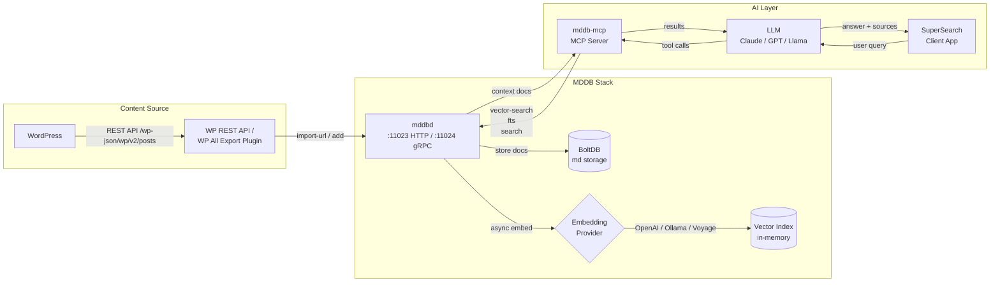
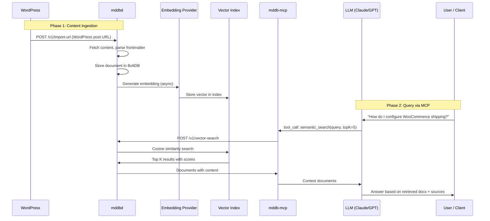
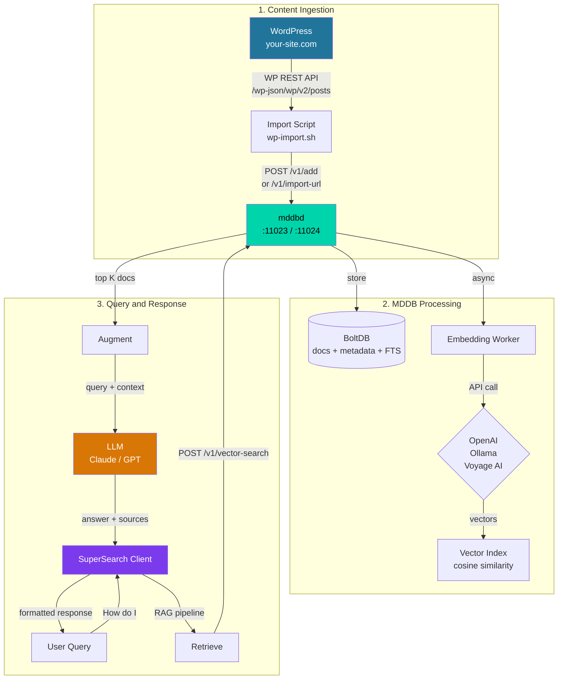
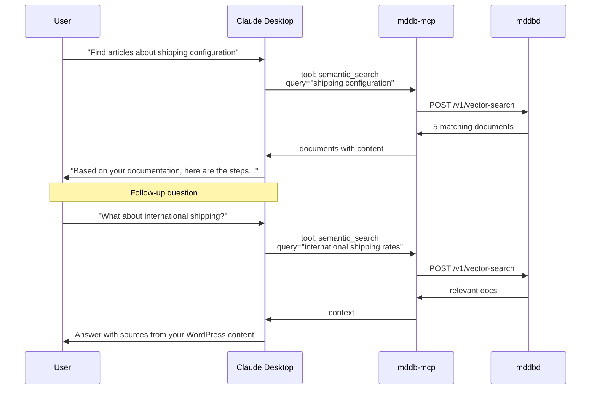

# RAG Pipeline with MDDB

Build a production RAG (Retrieval-Augmented Generation) pipeline using MDDB as the knowledge base, with WordPress as a content source and MCP for LLM integration.

## Architecture Overview



## Data Flow



## Step-by-Step Setup

### 1. Start MDDB with Embeddings

```bash
# docker-compose.yml
docker compose up -d

# Or run directly with embedding config
export MDDB_EMBEDDING_PROVIDER=openai
export MDDB_EMBEDDING_API_KEY=sk-your-key-here
export MDDB_EMBEDDING_MODEL=text-embedding-3-small
export MDDB_EMBEDDING_DIMENSIONS=1536

./mddbd
```

For local/free embeddings (no API key needed):

```bash
# Start Ollama first
ollama serve &
ollama pull nomic-embed-text

export MDDB_EMBEDDING_PROVIDER=ollama
export MDDB_EMBEDDING_API_URL=http://localhost:11434
export MDDB_EMBEDDING_MODEL=nomic-embed-text
export MDDB_EMBEDDING_DIMENSIONS=768

./mddbd
```

### 2. Import Content from WordPress

#### Option A: Import via WordPress REST API (recommended)

```bash
#!/bin/bash
# wp-import.sh - Import all WordPress posts into MDDB

WP_URL="https://your-site.com"
MDDB_URL="http://localhost:11023"
COLLECTION="blog"
LANG="en_US"
PAGE=1

while true; do
  # Fetch posts from WordPress REST API
  POSTS=$(curl -s "${WP_URL}/wp-json/wp/v2/posts?per_page=50&page=${PAGE}&_fields=id,slug,title,content,date,categories,tags,excerpt")

  # Check if we got results
  COUNT=$(echo "$POSTS" | python3 -c "import sys,json; print(len(json.load(sys.stdin)))" 2>/dev/null)
  [ "$COUNT" = "0" ] || [ -z "$COUNT" ] && break

  echo "Page $PAGE: importing $COUNT posts..."

  # Import each post
  echo "$POSTS" | python3 -c "
import sys, json, urllib.request

posts = json.load(sys.stdin)
for p in posts:
    # Convert HTML content to a usable format
    title = p['title']['rendered']
    slug = p['slug']
    content = p['content']['rendered']
    date = p['date']

    # Build MDDB document
    doc = {
        'collection': '${COLLECTION}',
        'key': slug,
        'lang': '${LANG}',
        'meta': {
            'title': [title],
            'source': ['wordpress'],
            'wp_id': [str(p['id'])],
            'date': [date],
        },
        'contentMd': f'# {title}\n\n{content}'
    }

    req = urllib.request.Request(
        '${MDDB_URL}/v1/add',
        data=json.dumps(doc).encode(),
        headers={'Content-Type': 'application/json'}
    )
    resp = urllib.request.urlopen(req)
    print(f'  imported: {slug} ({resp.getcode()})')
"

  PAGE=$((PAGE + 1))
done

echo "Done. Embeddings will be generated in the background."
```

#### Option B: Import individual URLs

```bash
# Import a single WordPress post by URL
curl -X POST http://localhost:11023/v1/import-url \
  -H 'Content-Type: application/json' \
  -d '{
    "collection": "blog",
    "url": "https://your-site.com/2026/01/my-post/",
    "lang": "en_US",
    "meta": {"source": ["wordpress"], "category": ["tutorial"]}
  }'
```

#### Option C: Python import script

```python
from mddb import MDDB
import urllib.request
import json

db = MDDB.connect('localhost:11023', 'write').collection('blog')

# Fetch posts from WordPress REST API
wp_url = "https://your-site.com/wp-json/wp/v2/posts?per_page=100"
with urllib.request.urlopen(wp_url) as resp:
    posts = json.loads(resp.read())

for post in posts:
    db.add(
        key=post['slug'],
        lang='en_US',
        meta={
            'title': [post['title']['rendered']],
            'source': ['wordpress'],
            'wp_id': [str(post['id'])],
            'date': [post['date']],
        },
        content_md=f"# {post['title']['rendered']}\n\n{post['content']['rendered']}"
    )
    print(f"Imported: {post['slug']}")

# Check embedding progress
stats = db.vector_stats()
print(f"Embeddings: {stats}")
```

### 3. Verify Embeddings

```bash
# Check vector stats - wait for all embeddings to complete
curl -s http://localhost:11023/v1/vector-stats | python3 -m json.tool

# Example response:
# {
#   "collections": {
#     "blog": { "total_documents": 142, "embedded_documents": 142, "total_chunks": 142 }
#   },
#   "queue": { "size": 1000, "depth": 0, "dropped": 0, "wait": "5s" },
#   "model": "text-embedding-3-small",
#   "dimensions": 1536
# }
```

`queue` is what tells you which kind of "not finished yet" you are looking at
when `embedded_documents` is below `total_documents`:

- **`depth` above zero** — still working. Wait and look again.
- **`dropped` above zero** — that many documents were stored without a vector
  because the queue was full and the writer gave up waiting. They are
  invisible to vector and hybrid search until reindexed:

  ```bash
  curl -X POST http://localhost:11023/v1/vector-reindex \
    -H 'Content-Type: application/json' -d '{"collection":"blog"}'
  ```

  Reindexing embeds exactly the documents that are missing one; `force: true`
  is for re-embedding a collection whose model changed, not for this.

An import large enough to outrun the embedding provider slows down rather than
losing work — a write waits up to `MDDB_EMBEDDING_QUEUE_WAIT` (default 5s) for
room. A batch that reports `embeddingDropped` in its response is telling you
that limit was reached; raise `MDDB_EMBEDDING_QUEUE_SIZE`, raise the wait, or
reindex afterwards.

### 4. Test Semantic Search

```bash
# Search by meaning - not exact keywords
curl -s -X POST http://localhost:11023/v1/vector-search \
  -H 'Content-Type: application/json' \
  -d '{
    "collection": "blog",
    "query": "how to set up an online store",
    "topK": 5,
    "threshold": 0.7,
    "includeContent": true
  }' | python3 -m json.tool

# Combine with metadata filter
curl -s -X POST http://localhost:11023/v1/vector-search \
  -H 'Content-Type: application/json' \
  -d '{
    "collection": "blog",
    "query": "payment configuration",
    "topK": 3,
    "filterMeta": {"category": ["woocommerce"]},
    "includeContent": true
  }' | python3 -m json.tool
```

### 5. Configure MCP for LLM Access

Add MDDB MCP to your Claude Desktop or Windsurf config:

```json
{
  "mcpServers": {
    "mddb": {
      "command": "docker",
      "args": [
        "run", "-i", "--rm", "--network", "host",
        "-e", "MDDB_MCP_STDIO=true",
        "-e", "MDDB_GRPC_ADDRESS=localhost:11024",
        "-e", "MDDB_REST_BASE_URL=http://localhost:11023",
        "tradik/mddb:latest"
      ]
    }
  }
}
```

Now the LLM has access to these tools:
- `semantic_search` - Find relevant documents by meaning
- `full_text_search` - Keyword search with TF scoring
- `search_documents` - Metadata-based filtering
- `add_document` - Store new knowledge
- `import_url` - Import content from any URL

### 6. Build a SuperSearch Client

#### Python client with RAG

```python
"""
SuperSearch - RAG client using MDDB + LLM.
Searches your WordPress knowledge base and generates answers.
"""
from mddb import MDDB
import json
import urllib.request

# --- Configuration ---
MDDB_ADDR = "localhost:11023"
COLLECTION = "blog"
LLM_API_KEY = "sk-your-openai-key"  # or use Anthropic API
LLM_MODEL = "gpt-4o"

db = MDDB.connect(MDDB_ADDR, 'read').collection(COLLECTION)


def search_knowledge(query: str, top_k: int = 5) -> list:
    """Step 1: Retrieve relevant documents via semantic search."""
    results = db.vector_search(
        query=query,
        top_k=top_k,
        threshold=0.65,
        include_content=True,
    )
    return results.get('results', [])


def build_context(results: list) -> str:
    """Step 2: Build context string from search results."""
    if not results:
        return "No relevant documents found."

    parts = []
    for i, r in enumerate(results, 1):
        doc = r['document']
        title = doc.get('meta', {}).get('title', ['Untitled'])[0]
        score = r['score']
        content = doc.get('contentMd', '')[:2000]  # trim long docs
        parts.append(f"[Source {i}] {title} (relevance: {score:.2f})\n{content}")

    return "\n\n---\n\n".join(parts)


def ask_llm(query: str, context: str) -> str:
    """Step 3: Send query + context to LLM."""
    messages = [
        {
            "role": "system",
            "content": (
                "You are a helpful assistant. Answer the user's question based on "
                "the provided context documents. Cite sources by their [Source N] "
                "reference. If the context doesn't contain enough information, "
                "say so honestly."
            )
        },
        {
            "role": "user",
            "content": f"Context:\n{context}\n\n---\n\nQuestion: {query}"
        }
    ]

    body = json.dumps({
        "model": LLM_MODEL,
        "messages": messages,
        "temperature": 0.3,
        "max_tokens": 1024,
    }).encode()

    req = urllib.request.Request(
        "https://api.openai.com/v1/chat/completions",
        data=body,
        headers={
            "Content-Type": "application/json",
            "Authorization": f"Bearer {LLM_API_KEY}",
        }
    )
    with urllib.request.urlopen(req) as resp:
        data = json.loads(resp.read())
    return data['choices'][0]['message']['content']


def supersearch(query: str) -> dict:
    """Full RAG pipeline: retrieve → augment → generate."""
    # Retrieve
    results = search_knowledge(query)

    # Augment
    context = build_context(results)

    # Generate
    answer = ask_llm(query, context)

    return {
        "query": query,
        "answer": answer,
        "sources": [
            {
                "key": r['document']['key'],
                "title": r['document'].get('meta', {}).get('title', [''])[0],
                "score": r['score'],
            }
            for r in results
        ],
        "source_count": len(results),
    }


if __name__ == "__main__":
    result = supersearch("How do I configure WooCommerce shipping zones?")
    print(f"Answer:\n{result['answer']}\n")
    print(f"Sources ({result['source_count']}):")
    for s in result['sources']:
        print(f"  - {s['title']} ({s['key']}) [score: {s['score']:.2f}]")
```

#### With Anthropic Claude API

```python
"""SuperSearch variant using Anthropic Claude API."""
from mddb import MDDB
import json
import urllib.request

MDDB_ADDR = "localhost:11023"
ANTHROPIC_API_KEY = "sk-ant-your-key"

db = MDDB.connect(MDDB_ADDR, 'read').collection('blog')


def supersearch_claude(query: str) -> str:
    # Step 1: Retrieve
    results = db.vector_search(
        query=query, top_k=5, threshold=0.65, include_content=True
    )
    docs = results.get('results', [])

    # Step 2: Build context
    context = "\n\n---\n\n".join(
        f"[{i+1}] {d['document'].get('meta',{}).get('title',[''])[0]}\n"
        f"{d['document'].get('contentMd','')[:2000]}"
        for i, d in enumerate(docs)
    )

    # Step 3: Call Claude
    body = json.dumps({
        "model": "claude-sonnet-4-5-20250929",
        "max_tokens": 1024,
        "messages": [{
            "role": "user",
            "content": f"Based on this documentation:\n\n{context}\n\n---\n\nAnswer: {query}"
        }]
    }).encode()

    req = urllib.request.Request(
        "https://api.anthropic.com/v1/messages",
        data=body,
        headers={
            "Content-Type": "application/json",
            "x-api-key": ANTHROPIC_API_KEY,
            "anthropic-version": "2023-06-01",
        }
    )
    with urllib.request.urlopen(req) as resp:
        data = json.loads(resp.read())
    return data['content'][0]['text']
```

## Complete Pipeline Diagram



## MCP-Based Pipeline (Alternative)

Instead of building a custom client, let the LLM call MDDB directly via MCP:



## Hybrid Search Strategy

Combine vector search with full-text search for best results:

```python
from mddb import MDDB

db = MDDB.connect('localhost:11023', 'read').collection('blog')


def hybrid_search(query: str, top_k: int = 5) -> list:
    """Combine semantic + keyword search for better recall."""

    # Semantic search (finds related concepts)
    vector_results = db.vector_search(
        query=query, top_k=top_k, threshold=0.6, include_content=True
    )

    # Full-text search (finds exact keyword matches)
    fts_results = db.fts_search(query=query, limit=top_k)

    # Merge and deduplicate by key
    seen = set()
    merged = []

    for r in vector_results.get('results', []):
        key = r['document']['key']
        if key not in seen:
            seen.add(key)
            merged.append({
                'key': key,
                'document': r['document'],
                'vector_score': r['score'],
                'match_type': 'semantic',
            })

    for r in fts_results.get('results', []):
        key = r.get('key', '')
        if key not in seen:
            seen.add(key)
            merged.append({
                'key': key,
                'document': r,
                'fts_score': r.get('score', 0),
                'match_type': 'keyword',
            })

    return merged[:top_k]
```

## Production Tips

1. **Embedding provider**: OpenAI `text-embedding-3-small` gives the best price/quality ratio. For local/free use Ollama with `nomic-embed-text`.

2. **Chunk long documents**: WordPress posts can be long. Consider splitting into sections before import for better vector search precision.

3. **Use metadata filters**: Narrow down vector search with `filterMeta` to improve relevance (e.g., filter by category, date range).

4. **Schema validation**: Use MDDB's schema validation to enforce consistent metadata:
   ```bash
   curl -X POST http://localhost:11023/v1/schema/set -d '{
     "collection": "blog",
     "schema": "{\"required\":[\"title\",\"source\"],\"properties\":{\"source\":{\"enum\":[\"wordpress\",\"manual\"]}}}"
   }'
   ```

5. **Monitor embeddings**: Check `/v1/vector-stats` to ensure all documents are embedded before running searches.

6. **Reindex after model change**: If you switch embedding providers, reindex:
   ```bash
   curl -X POST http://localhost:11023/v1/vector-reindex -d '{"collection":"blog","force":true}'
   ```
